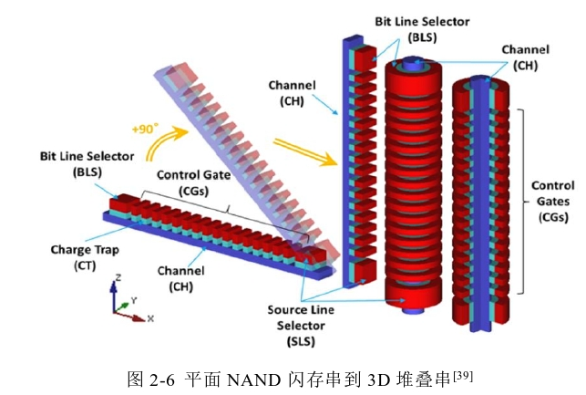
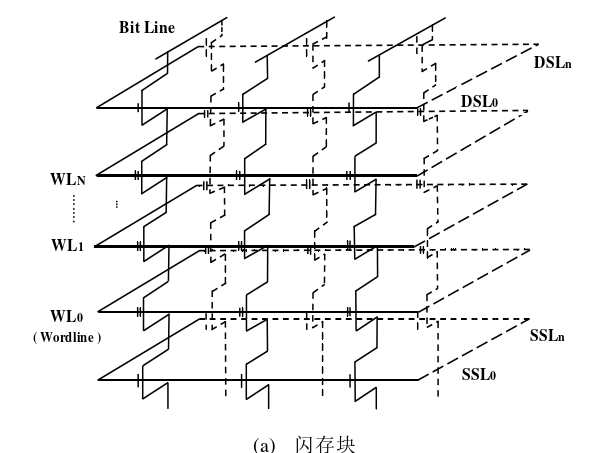
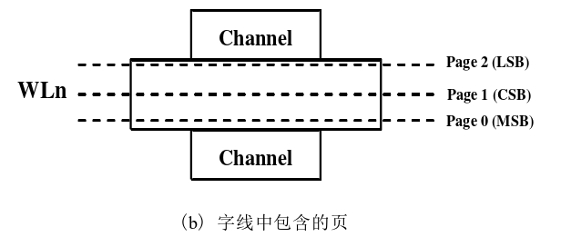
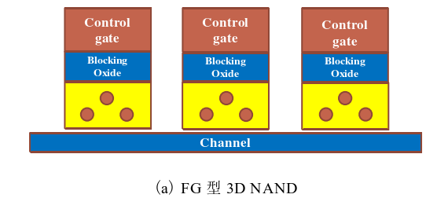
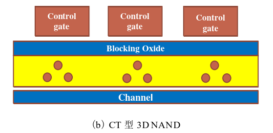
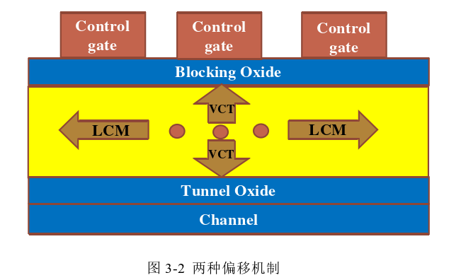
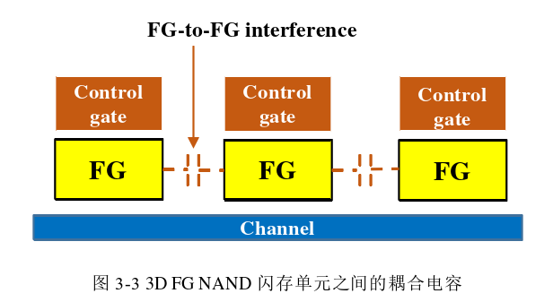

### 简述
在2D NAND闪存中FG型占据绝对的主流，但在3D NAND 闪存中，因为结构的变化，大多主流厂商开始采用CT型NAND闪存，但仍然有厂商采用FG型闪存。

写：尽管写入的过程从原理上是电子注入的过程，但因为存储单元的材料的特性不同，FG和CT型的NAND闪存存在着不同的写入过程。

CT型因为采用绝缘材料作为电子的存储单元，存储单元之间不存在相互干扰，CT型TLC NAND的写入过程采用一步编程的策略

而在FG型的存储单元采用的是导体材料作为存储电 子的存储单元，存储单元之间的耦合效应一直是FG型闪存的主要噪声之一，**为了减少单元之间的干扰**，FG TLC NAND闪存的写入操作采用多步编程策略，不同厂商的FG型闪存芯片对应的存储状态有所不同，多步编程策略也有所不同。 

### 2D->3D
**2D**:芯片尺寸的下降，增加了存储密度，存储单元之间 的距离相应的越来越近。单元间之间的干扰作为平面NAND闪存中一项重要的影响噪 声，受到尺寸减小的影响更为明显。

同时多比特技术导致存储状态增多，不同存储状态 之间的间隔电压，也称判决边界不断减小，更容易出现读参考电压无法直接判决的存 储状态重叠区域。

传统的2D NAND闪存是在平面上增加存储单元数，来增加存储密度，3D堆叠  NAND闪存可以说是在此基础上经过优化改良后产生的。

3D NAND闪存的结构可以分 为水平通道水平门型、垂直通道水平门型以及水平通道垂直门型。早期的结构主要采 用的是水平通道水平门型，这种结构基本是在2D平面闪存的基础上进行堆叠，目前主 流的结构是经过改良后的垂直通道类型[ 19]。 

如图2-6所示，垂直通道类型的串从平面NAND闪存转变的演示图，垂直方向形 成一个圆柱体结构，中间靠一个圆柱支持柱来维持，从里向外依次为通道、氧化层、电 荷存储层、绝缘氧化层以及控制极。通道的水平和垂直的区分是根据由存储单元组成的串的位置状态来进行区分，平面NAND闪存的串的存储单元是水平方向上排列，在 3D NAND闪存中，组成串的存储单元是垂直方向上排列。 

3D NAND闪存物理块的结构简略图，如图2-7所示，其由一定量的存储层堆叠组 成的。其中每个层又由数个字线（Wordline）构成，一个字线中又由数个物理页构成， 物理页的数量由NAND闪存的类型所决定，SLC型只有一个物理页，MLC型有两个 物理页.

源极选择线（Source Selective Line， SSL）和漏极选择线（Drain Selective Line，DSL）控制着存储数据的读取、写入、以及 擦除操作。 

### 噪声
平面：随机电报噪声（Random  Telegraph Noise，RTN）、持久性干扰噪声（Retention time）、单元间干扰噪声（Cell-to-Cell Interference，CCI）、读干扰噪声（Read Disturb）、编程干扰（Program Disturb）等。

其中持久性噪声、读干扰噪声以及编程噪声干扰在3D NAND中的影响同样 有着重要地位

3D：层间结构差异性干扰（Layer variation）、存储保 存时间早期的电荷流失干扰（Early retention loss）、不同温度下的读写干扰（Cross temperature）等。

### 两种电子偏移机制
FG NAND闪存的存储单元使用材料为多晶硅，一种导体材料来存储电荷，CT  NAND闪存的存储单元使用绝缘体材料来对电荷进行存储

CT型3D NAND 闪存的存储单元之间是相互连接的，而FG型3D NAND闪存的存储单元之间是相互隔 开的

**两种电子偏移机制**:侧电子偏移（Lateral Charge Migration，LCM）和垂直方向上的电子流失（Vertical charge de-trap，VCT）机制。

LCM:存储单元中的电子随着存储时间的增加会朝着两边的存储单元偏移，称其为 LCM效应。因为3D CT NAND闪存单元之间相互连接的结构，使得LCM效应**只会存在于CT 3D NAND闪存中**

缺点：由于LCM效应的存在，数据持久性噪声对CT型3D NAND闪存的影响要比FG 型3D NAND闪存要强。除此之外，高温情况下也会加深LCM效应的影响。因此，对 于3D堆叠CT NAND闪存来说，LCM效应是影响其稳定性的关键挑战。

优点：结构更加适 合3D NAND的层数堆叠，能简化制造工艺流程，大大降低堆叠过程中的制造的工业成 本。

VCT:垂直方向上的电子流失，将其称为VCT效应，均存在于FG和CT型3D NAND闪 存中。造成VCT效应的原因是因为用于困住存储单元中的电子的绝缘氧化层（Tunnel  Oxide）在经过一定量的编程、擦除操作后，电子经过电子隧穿效应不断的穿过氧化层， 对绝缘氧化层造成不可逆转的物理磨损。磨损达到一定的程度后，被绝缘氧化层困在 存储单元中的电子会不可避免的流失到下面的通道中，随着保存时间的增加，这种流 失会愈发明显。**在FG 型3D NAND闪存中的影响更大，可以理解为电子在导体材料中更容易流动也更容易 流失**

CT 3D NAND:*在不同的使用的阶段，不同的效应占据主导地位。*

低磨损的情况下，此时的氧化层的磨损相对较小，此时的LCM偏 移机制对其稳定性的影响较大；而在高磨损的情况下，此时的VCT效应对稳定性的影 响占据主导地位，电子流失的影响比电子偏移的影响要大的多.

除了上述的偏移机制以外，在FG 3D NAND闪存中，同样存在着和平面NAND闪 存中相同的单元间干扰噪声。

在3D FG NAND闪存中,基本存储单元 之间会形成耦合电容。

因为这种形成的耦合电容的存在，在对某一个存储单元进行编 程时，其相邻的存储单元会产生联动，这种联动通常称为电容耦合效应，电容耦合效应 会使周围存储单元的阈值电压同样受到影响，最终造成相邻存储单元阈值电压产生偏 移。为了抑制电容耦合效应产生的影响，如前面提到的，在FG型3D NAND闪存在对 存储单元进行编程时，会采用多步编程的方式。CT型3D NAND闪存中，因为采用绝 缘体材料存储电荷的缘故，并不存在电容耦合效应，在对存储单元进行编程操作时，直接采用一步编程的方式。 