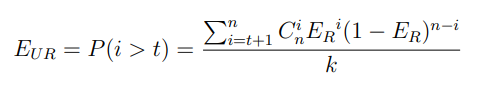

<!-- vscode-markdown-toc -->
* 1. [BCH码](#BCH)
* 2. [LDPC码](#LDPC)

<!-- vscode-markdown-toc-config
	numbering=true
	autoSave=true
	/vscode-markdown-toc-config -->
<!-- /vscode-markdown-toc -->

# 3D NAND与纠错码
##  1. BCH码
为了提高闪存存储的可靠性，会在闪存控制器内加入容错机制。其中，最为常见和性价比最高的容错方法就是纠错码，检测或纠正一定范围内的错误比特。

最为流行的是BCH码，这些冗余的编码被存储在闪存页的带外空间中。

BCH编码是有限域的线性分组码，可以纠正一段数据中的多个比特错误，对于原始比特误码率ER，其不可纠正的比特误码率EUR可以通过随即发生比特错误的二项分布进行计算：

其中，t 为 BCH 编码在满足不可纠正错误率满足限制时的最小纠错能力。对于NAND闪存存储，不可纠正错误率一般限制为小于或等于10-15。

当码字长度固定，纠错能力和校验位的位数为非负相关关系。在 NAND 闪存中，闪存页的错误率与闪存的磨损程度有十分强的相关性，即随着 P/E 周期数的增大，比特错误率会迅速上升。为了保证闪存设备在整个生命周期内不发生数据丢失，需要纠错码有足够大的纠错能力去纠正最坏情况下的比特错误率。导致纠错能力在寿命的初期和中期过于强大，造成不必要的存储空间和性能浪费。

基于对 3D NAND 闪存特征的提取和分析，可以发现：

    1. 一个芯片中的各闪存块及一个闪存块中的各页表现出不同的失效速度，并且随着 P/E 周期的增加，失效速度显著增加；
    2. 不同类型的页之间比特错误率相差很大；
    3. 编程干扰错误、读干扰错误和数据保留错误均呈现出位置相关性。

3D NAND 的这几个特征意味着可以在 3D NAND 闪存中可以采用码率自适应的纠错码，其基本思想是在保证闪存整个生命周期内的不可纠正比特错误率在限制范围之内的条件下，尽可能的减小码率。码率自适应的纠错码的自适应性提现在三个方面：

1. **生命周期**：
    - 在生命周期中，闪存页的比特错误率与 P/E 周期数呈近似指数的关系迅速上升。因此，在前期，可以采用较小的码率；在中期，采用中等的码率；在后期，采用较大的码率。
2. **页类型**：
    - 由于在相同的条件下，SLC 页和低页的比特错误率会相对高页低很多，因此，对于 SLC 页和低页，可以采用较小的码率；对于高页，可以采用较大的码率。
3. **位置**：
    - 3D NAND 闪存中的错误呈现出很强的位置相关性，因此，在比特错误率低的位置，可以采用较小的码率；在比特错误率较高的位置，可以采用较大的码率。

##  2. LDPC码

基于对3D NAND闪存特征的提取和分析，可以发现：

    - 3D NAND闪存中的比特错误率很高；
    - 编程干扰错误、读干扰错误和数据保留错误均呈现出数值相关性。

由于 3D NAND 闪存中的高错误率，传统的 BCH 编码需要很长的校验位，既占据了大量的存储空间，也降低了读性能。LDPC 是一种具有稀疏校验矩阵的线性分组码，不仅具有良好的性能，而且译码复杂度低，结构更为灵活，正在逐渐被应用到3D NAND 闪存的纠错机制中。采用软判决译码的 LDPC 可以充分利用接收到的信道信息，即软信息，极大地提高了信道信息的利用率。通过迭代进行的译码过程，对信道中的信息进行充分地挖掘，从而大幅的提高了译码性能。

从对 3D NAND 闪存错误特性的分析中可以看出，无论是编程干扰错误、读干扰错误还是数据保留错误，都呈现出很强的数值相关性，即不同比特翻转发生的概率是不同的。通过利用错误数值变化的概率信息，能够产生基于概率的软信息，以增强 LDPC 解码的性能从而降低解码延时。