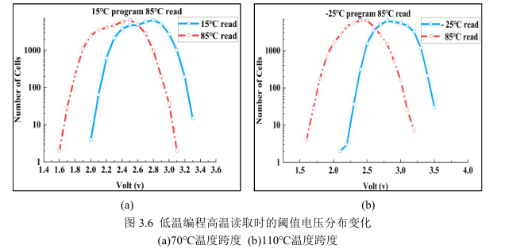
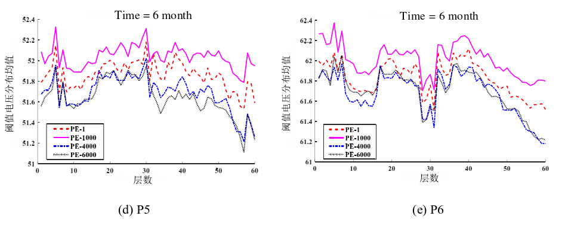

- [相关概念](#相关概念)
- [可靠性问题](#可靠性问题)
  - [1.耐久性 PEC噪声](#1耐久性-pec噪声)
  - [2.数据保持性 Data Retention噪声](#2数据保持性-data-retention噪声)
  - [3.读干扰 Read Disturb噪声](#3读干扰-read-disturb噪声)
  - [4.写干扰](#4写干扰)
  - [5.层差异 Layer Variation噪声](#5层差异-layer-variation噪声)
  - [干扰错误](#干扰错误)
- [温度影响](#温度影响)
  - [变温特性](#变温特性)
    - [耐久度](#耐久度)
    - [阈值电压分布](#阈值电压分布)
      - [升温(-10℃-\>80℃)：](#升温-10-80)
      - [降温(80℃-\>10℃)：](#降温80-10)
- [P/E cycle](#pe-cycle)
  - [PEC-DR阈值电压分析](#pec-dr阈值电压分析)
    - [误码率](#误码率)
  - [PEC-RD阈值电压分析](#pec-rd阈值电压分析)
    - [误码率](#误码率-1)
  - [不同层的差异](#不同层的差异)
    - [误码率](#误码率-2)
  - [不同页的差异](#不同页的差异)
- [写干扰（编程干扰）](#写干扰编程干扰)
- [读干扰](#读干扰)
- [数据驻留](#数据驻留)
- [写错误](#写错误)

# 相关概念
**闪存耐久度**：

闪存的耐久度由最大编程和擦除(**P/E**)周期数来衡量，该次数表示可以对闪存块进行编程和擦除而不会产生不可纠正错误的次数。

在闪存使用寿命的早期阶段，其原始误码率非常低，因此ECC可以纠正错误。但是在寿命的后半部分，由于存储单元的性能下降，原始误码率变得过高，并且ECC无法保证校正损坏的数据。为避免这种情况，闪存制造商限制了最大P / E周期数。一般3D NAND制造商为确保所有的存储单元都能达到这个标准，会把等级设置的较低。
# 可靠性问题
## 1.耐久性 PEC噪声
3D NAND 的耐久性错误是指存储器阵列失去存储数据或根据其可靠性规范检索数据的能力。

大多数的耐久性错误都是由**写入错误**造成的，写入错误是指存储单元过度编程，超过了陈列的每个单元可以安全地执行最大数量的编程和擦除周期，一旦超过这个最大值，就会使浮栅层/电荷捕获层耗尽而导致隧穿失败
## 2.数据保持性 Data Retention噪声
数据保持错误是指：在阵列中未执行任何操作但单元阈值电压却发生变化而导致的错误。

各种各样的物理现象都会导致数据保持错误，但其中最相关的是由**隧道氧化层缺陷**引起的。隧道氧化层固有缺陷引起随机电报噪声（RTN）的波动和隧道氧化物的电荷剥离都会引起阈值电压的偏移，导致闪存的数据保持错误。

改变单元阈值电压，造成存储单元的阈值电压状态与数据存储期间的目标
阈值电压状态不同，同样会导致数据保持错误。
## 3.读干扰 Read Disturb噪声
从一个闪存单元中读取数据 对该闪存单元的电压偏移影响不大，但会导致同一块中的其他未读的闪存单元阈值电压向右偏移。随着读取次数的增加，偏移电压值越来越大，导致产生不可纠正的读取干扰错误。 
## 4.写干扰 
写干扰是指编程过程中受到相邻闪存单元干扰从而引起目标闪存单元出现误码 的现象。目标闪存单元即为受到写干扰的闪存单元。当相邻闪存单元阈值电压增加时，由于寄生电容耦合产生干扰导致目标闪存单元也出现阈值电压增大的情况。

## 5.层差异 Layer Variation噪声
## 干扰错误
1. **较为常见**：由于阵列中其他单元的单元电压状态的改变，在读取过程中改变了其静电和传导环境。当单元电压状态被修改的单元与先前编程的单元是相邻单元时，就会导致先前编程的单元电压增加。
2. 干扰错误中还有一种反向模式效应，它是指在编程操作期间，先前编程的单元受到同一个阵列串中非相邻单元的串联电阻的增加，导致单元电压增加，这同样也会导致干扰错误。
# 温度影响
3D NAND多用多晶硅材料制成其沟道（**在垂直堆叠的3D结构中作为通道导电层，而不是作为电荷存储层吗？？？**），而多晶硅材料的多晶特性使3DNAND闪存存储器对温度变化较为敏感，因为多晶硅材料中普遍会存在许多晶粒，晶粒与晶粒相邻的界面形成晶界，晶界中会存在较高密度的缺陷，当温度变化时，这些缺陷对电荷的捕获能力也有所不同。

如下图(a)所示为不同温度下多晶硅沟道中晶界处陷阱的填充（占有）率，即载流子被陷阱捕获的概率，可以看出沟道内的沟道内的缺陷在低温情况下比在高温情况下对载流子的捕获率高，且**温度越低时，晶界处的陷阱对载流子的捕获率越大**。

因这些缺陷在不同温度下对载流子不同的捕获概率进而对字符串
沟道电流产生的影响如图(b)所示，可以看到相同字线电压条件下，**温度越低，字符串内电流（Is），即导通电流越小**，所以在低温情况下读取存储单元时需要施加更高的字线读取电压，以确保产生的导通电流在经放大器放大被相应电路检测到时处于预设定的范围之内，进而正确确定存储单元存储的数据状态

除此之外，不同温度下的通道电流也与多晶硅沟道中的晶粒大小和晶粒数量有
关，表现为温度越低且晶粒尺寸越大时，通道电流越小，同时晶粒数量越多时，通道电流也越小.

温度变化会导致沟道的导通电流有所不同，反映在存储单元的阈值电压上即为温度变化会引起其阈值电压也相应有所波动,如下图所示。

## 变温特性
### 耐久度
1. **高温85℃**：浮栅型结构在高温下，电子不会从陷阱中逃逸，因此浮栅型会比电荷捕获型结构在高温下更加稳定。 
在3D NAND寿命方面，都下降了约50%，MLC在高低温下的寿命可靠性方面相对于TLC来说
还是有不小的优势。 
随着P/E周期次数的增加，原始错误比特数都呈现出上升的趋势，块中页面号后半部分上升的趋势尤其突出，表现出尖峰状。由于块中页面号后半部分对应存储阵列的边缘部分，边缘部分的可靠性受到高温影响波动相对较大。 

3D NAND TLC 阈值电压的窗口比3D NAND MLC窄，因此更容易受到温度环境的影响，无论在哪个温度下，都会使得阈值电压右移，低温的情况下阈值电压右移的情况更严重。
### 阈值电压分布
#### 升温(-10℃->80℃)：
阈值电压分布发生了明显的**向左偏移**，当温度变化幅度越大时，存储单元阈值电压分布的偏移量也就越多，阈值电压减小。

同时，其不平行偏移的情况具体表现为**低温时阈值电压较小的存储单元在温度升高时其阈值电压的偏移量较大，而低温时阈值电压较大的存储单元在温度升高时其阈值电压的偏移量较小**，从而引起阈值电压分布在偏移的同时出现展宽的现象，

#### 降温(80℃->10℃)：
**阈值电压分布的向右偏移**，温度变化幅度越大，存储单元阈值电压分布的偏移量就越多，阈值电压增大。**且造成的偏移明显小于升温**。

同时可以观察到，当温度变化时，存储单元的阈值电压分布出现了不平行偏移情
况，具体表现为**高温时阈值电压较大的存储单元在温度变低时其阈值电压的偏移量较大，而高温时阈值电压较小的存储单元在温度变低时其阈值电压的偏移量也较小，最终使得低温情况下，存储单元的阈值电压分布出现了展宽的现象**。

展宽现象原因：**与所选中存储单元本身的阈值电压及与其处在同一字符串上的其他单元的特性有关**，如处于字符串底端的选择晶体管单元BSG（Bottom Select Gate），因为BSG晶体管的制造工艺不同于其他存储单元，以至于相对于正常的存储单元，其阈值电压较大，且发现BSG的温度系数较大时，存储单元的温度系数也较大。读取操作时，若施加在BSG单元上的导通电压较小时，字符串通道电流将会被限制，被选中存储单元的阈值电压就会增大，导致出现较大的阈值电压偏移，可通过增大BSG的导通电压来抑制。

**结论**：温度升高，阈值电压会减小，温度降低，阈值电压会增大，使得存储单元的阈值电压分布随温度变化而出现一定的偏移，同时存在不平行偏移的情况，最终造成分布的展宽。

# P/E cycle
侧方向的电子偏移以及垂直方向上的电子流失是3D NAND闪存数据造成损坏以及丢失的底层机制。而不断增加的P/E Cycles，对绝缘氧化层造成的磨损是产生垂直方向的电子流失的根本原因。

*下面的两个图为3D FG TLC NAND*
## PEC-DR阈值电压分析
随着数据保存时间的增加，在相同的保存时间下P/E Cycles的次数越多，错误比特数越多。

错误比特数在保存时间达到6个月左右时，会有一个非常明显的增长，而在6个月之前的增长速度相对显得非常平缓.

在数据的保存时间达到12个月后， 由于P/E Cycles的次数造成的稳定性不同才有较为明显的差距。

数据的保存时间达到3年，不同的P/E Cycles下的阈值电压分布有所不同，随着保存 时间和P/E Cycles次数共同的增长，阈值电压的分布向左开始偏移，且P/E Cycles更高的更加倾向于向左有更多的偏移。 

下图为在P/E Cycles和数据保存时间噪声的共同作用下，3D FG TLC NAND闪存的阈值电压分布情况。从该图中可以发现，3D FG TLC NAND闪存的阈值电压分布情况基本是向左偏移，并且随着P/E Cycles和数据保存时间的增加偏移幅度越大，且低状态（0P、 1P、2P、 3P）的偏移幅度相对较大，高状态（4P、 5P、6P、 7P） 的偏移幅度较为稳定。

**结论**：
1. 单独的P/E Cycles对其阈值电压分布的影响很小，需要在经过一定的保存时间后其干扰才会逐渐显现出来。在只存在垂直方向上的电子流失效应的3D FG NAND 中，这种类似的现象同样也反应在数据保存时间对其阈值电压分布的影响当中，P/E  Cycles和数据保存时间的共同影响才会对阈值电压分布产生明确的影响。

2. 数据保存时间噪声使存储单元中的电子产生流失，造成阈值电压分 布向左偏移的趋势，而P/E Cycles的增加对于封锁存储单元中电子的绝缘氧化层的磨 损加速了这一趋势。 

3. 一旦P/E Cycles使绝缘氧化层的不可逆转的物理磨损达到一定程度时，其阈值电压分布相对刚写入时的偏移幅度会非常明显

*3D CT TLC NAND*

与3D FG TLC NAND闪存中相同的是，数据保存时间导致的电子流失造成阈值电压分布向左偏移，P/E Cycles的次数增加会放大这种趋势。

不同的是在3D CT TLC NAND闪存中，阈值电压分布更容易受到数据保存时间噪声的影响。**原因与3D CT TLC NAND闪存的基本存储单元结构和相邻状态的之间的电压差**有关。彼此相互连接的基本存储单元以及高低 状态之间形成的电压差，产生电场使得高状态中存储的电子更容易向相邻的低状态转移。

### 误码率

图中纵坐标为采用对数单位的误码率，可以方 便观测到3D NAND闪存内部错误的数量级情况，横坐标为PEC的次数，共有11个 PEC记录点，范围为0到10000；共有5个DR时长，范围为1分钟到10000分钟。

FG型3D NAND闪存的误码率情况如下图所示：

在相同PEC噪声强度下，误码率随着DR时间有着先降低再升高的趋势；在相同的DR时长下，误码率随着DR时间有着增长的趋势；随着PEC次数的增加，误码率随着DR时间先降低再升高的变化更加明显。

误码率总体上存在一定波动，可能与FG型3D NAND闪存的导体浮栅极导体结构更容易受到每次擦写的电压干扰以及闪存单元间干扰(Cell-to-Cell Interface,CCI)导致的误码率波动有关。

CT型3D NAND闪存的误码率情况如下图所示：

与FG型3D NAND闪存类似，在相同PEC干扰下误码率随着DR时间先降低再上升；在相同的数据存储时长情况下，误码率随着PEC次数增加而增加；PEC噪声强度增加使得不同时间的DR误码率差异更大。

CT闪存在误码率随着噪声强度变化趋势上更为稳定，没有较大的波动情况的出现，考虑是其绝缘材料的电荷捕获结构使得CT型3D NAND闪存对于CCI干扰等更不敏感，所以误码率的变化情况 更为稳定。

**结论**：

1. 除了FG型3D NAND闪存的误码率波动性稍大外，两种TLC在耦合噪声影响下的误码率变化趋势**基本一致**。
2. **误码率情况随着PEC增加而增加**，这是由于PEC带来的电荷存储层磨损使得闪存电 荷保持能力下降，存储可靠性降低。
3. **误码率随着DR时间增长先降低后上升**， 在两种3D NAND闪存的PEC-DR误码率结果中，均能观测到DR为10分钟时的误码 率曲线低于1分钟时的误码率曲线
4. **PEC噪声和DR噪声有着较为明显的耦合现象**，表现为不同DR对应的误码率曲线在PEC 影响下变化趋势不一致，这是因为闪存电荷存储能力受到PEC噪声磨损，使得时间更 长的DR更加容易产生错误。

## PEC-RD阈值电压分析
对于PEC-RD耦合噪声加噪处理后的两款3D NAND闪存芯片进行阈值电压扫描 后，利用热力图对阈值电压分布变化情况进行了表示。

横坐标为阈值电压的电压值，纵坐标为PEC-RD噪声组合，其中 每一个白色虚线分割而成的小区间代表着RD噪声强度，每一个RD噪声区间内又由 11个更小的PEC噪声区间组成。

**FG**:在每个RD区间内对应的PEC=10000的位置均能看到一个明显向左偏移的阈值电压分布。除此之外，3D FG TLC NAND闪存的热力图阈值电压分布较为稳定，没有其他显著变化。

**CT**:在一个RD小区间内， PEC次数越多，阈值电压分布正偏越严重。这说明CT型3D NAND闪存在经过多次 PEC后，受到的读取干扰更严重，多次读取后Cell内产生了异常电荷注入，使得阈值电压分布产生正偏。

**结论**:FG型3D NAND闪存阈值电压只有在 PEC=10000后才产生明显变化；CT型3D NAND闪存的阈值电压在相同的读取次数下， PEC噪声越大产生的阈值电压分布正偏越严重。
### 误码率

纵坐标为误码率对数值，横坐标的PEC次数为0到10000的11个记录点；不同的RD噪声干扰强度用不同的线表示。

3D FG TLC NAND:

3D CT TLC NAND:

**FG**:在PEC次数相同的条件下，读 取次数越多RD噪声越大，其误码率将随之上升；在相同的读取次数条件下，误码率 随着PEC增加而增加；随着PEC增加，RD噪声的误码率曲线的变化率产生了变化。

**CT**:误码率变化与FG型3D NAND 闪存的变化基本一致，值得注意的是在CT型3D NAND闪存中可以明显观测到这几条不同RD噪声的误码率曲线的斜率随着PEC次数增加产生了明显的变化，且误码率波动情况较小。

**结论**:

1. FG型和CT型3D NAND闪存误 码率变化趋势基本一致。
2. 主要的错误依然是PEC带来的磨损导致可靠性降低.
3. 误码率随着RD噪声强度的增加而增加，在两种3D NAND闪存的PEC-RD误码率结果 中，可以观测到RD误码率曲线斜率随着PEC次数增长而变大的趋势，这说明PEC噪声与RD噪声产生耦合作用并放大了RD噪声对3D NAND闪存的干扰.
4. 从最差的误码率情况来看，PEC-RD噪声耦合强度的误码率均低于PEC-DR噪声耦合强度，说明PEC-RD耦合噪声对闪存可靠性的影响程度不如PEC-DR耦合噪声。
## 不同层的差异
在3D NAND闪存中，除了受到磨损以及环境噪声后产生的阈值电压分布偏移后造成的判决错误，其发生错误也呈现出一定的差异性，产生差异性的原因主要由于3D NAND闪存采用的**锥形结构**所引起的

下面为3D FG TLC NAND闪存在不同的磨损程度下，各个状态下在不同层的阈值电压均值情况。因为$P_0$为擦除状态，因此，在图中只有$P_1、P_2、P_3、P_4、P_5、P_6、P_7$七种状态下的阈值电压均值在不同层的分布情况。

**结论**：
1. 随着磨损程度的增加，也就是P/E Cycles和数据保存时间共同的增加，整体的阈值电压分布均值基本都呈现出下降的趋势。

2. 在相同的磨损状态下，不同层的阈值电压分布均值均不相同，呈现出差异化，且随着磨损程度的增加，不同层的之间的差异化更加明显。造成此现象的原因则是由3D NAND闪存自身的结构引起的。 
采用垂直通道类型结构的3D  NAND闪存的垂直通道结构体的直径会随着层数的增加逐渐变小，但在制造过程中，会发生一些形变，例如出现通道弯曲，结构扭曲等，最不可避免的是从相对高的层到相对低的层之间的通道直径差异。 
不同层的绝缘氧化层的厚度也会受到这种自上而下依次减少直径结构的影响。

3. 在总层数的中间层附近的相邻层中，例如此图中的第32层附近，会出现非常明显的阈值电压分布均值的跳变点。在垂直通道类型的3D NAND闪存中，为了防止层数不断增加导致的不同层的存储单元的物理特性差距过大的问题，部分厂商会采用串堆叠技术来进行优化。 
**串堆叠技术**将一个3D NAND闪存在垂直方向上分为多个部分，每个部分拥有相 同的层数，每个部分单独进行堆叠，来优化因为层数过多而导致的不同层通道直径差 距过大的问题。实际测试的3D FG NAND闪存芯片为总层数为64层的结构，采用串 堆叠技术分为两个32层的串。两个串相邻的两个层，一个是串的最底部，另一个为串的最顶部。
### 误码率

横坐标为层数编号，纵坐标为原始误码率对数值，不同曲线代表不同程度的PEC噪声干扰。

3D FG TLC NAND:

3D CT TLC NAND:

**FG**:在PEC为0的时候，可以观测到误码率在中间层有一个较为明显的跳变产生，该跳变产生是因为美光B17A系列的66层3D堆叠技术采用了Double Deck的结构，即通过堆叠2组33层3D NAND的 Deck结构从而得到66层的堆叠数量，所以在在两个Deck连接的中间层部分会产生一个误码率差异。该跳变在PEC噪声为10000的时候依然存在，两个PEC状态下的层间误码率的整体趋势较为接近。

**CT**:在PEC为0的时候，可以观测到误码率整体趋势是随着层数编号增加而增长；但是在PEC为10000的时候，误码率的整体趋势变成了随着层数编号增加而减少。

## 不同页的差异

下面为为3D FG NAND低页、中页、高页，在不同程度的使用磨损下的原始误码率。

不同页间差异明显，低页的稳定性要远远强于中页和高页。

在3D CT NAND闪存芯片中，如下图所示，不同页之间的稳定性差异同样明显，低页的稳定性同样要优于高页和中页。 

**原因分析**：不同页之间的稳定性差异性，由不同页的读取过程以及各个状态之间的偏移速率 不同，导致不同相邻状态之间重叠区域程度情况不同而造成的。

更高状态的单元容易变为相邻低状态的单元，两个相邻低状态之间的重叠区域相对较少，闪存中数据读取操作以页为基本单位，有的页在读取过程中需要区分相邻的高状态的次数较多，因此也造成了该页的原始误码率对比其他页更高。

如下图，3D CT TLC NAND闪存随着P/E Cycles和数据保存时间的增加，阈值电压分布向左偏移，$P_6$和$P_7$的偏移速率 不同，导致两种相邻状态之间相互转换比较多，产生的重叠区间较大，高页的读取过程中需要施加读参考电压来区分$P_6$和$P_7$这两种状态，这也导致了的高页的原始误码率相对 低页要高很多。 

# 写干扰（编程干扰）
写干扰是指编程过程中受到相邻闪存单元干扰从而引起目标闪存单元出现误码 的现象。

目标闪存单元即为受到写干扰的闪存单元。当相邻闪存单元阈值电压增加时， 由于寄生电容耦合产生干扰导致目标闪存单元也出现阈值电压增大的情况，最终导致误码。

**原理**：

受干扰的目标闪存单元的阈值电压的变化是源自于相邻闪存单元阈值电压变化的共同影响，可以表示为相邻闪存单元在编程时产生的阈值电压偏移的线性组合。从物理上来说，越贴近受干扰目标闪存单元，对目标闪存的干扰越大，相当于目标闪存单元受干扰的主要因素。

相邻闪存单元进行编程操作的话，可能会对目标闪存引起的干扰量可以表示为下式
$$
\Delta V_{target} = \sum_{x} K_{x} \Delta V_{x}
$$

其中$\Delta V_{target}$代表目标闪存单元因受到写干扰引起阈值电压变化量，$K_{x}$是相邻的闪存单元X与目标闪存单元之间的耦合系数，$\Delta V_{x}$是闪存单元X在编程时出现的阈值电压变化量。

耦合系数对于相邻字线、同一位线上的闪存单元是最大的。耦合系数与相邻闪存单元X和目标闪存单元之间的有效电容C直接相关，可以通过下式进行计算：
$$
C = \frac{\varepsilon S}{d}
$$
$\varepsilon$是介电常数，S是闪存单元X面向目标闪存单元的有效闪存面积，d是闪存单元X与目标闪存单元之间的距离。

相邻闪存单元中，字线相邻闪存单元的有效闪存面积更大，与目标闪存单元之间的耦合电容最大。

**结论**：
1. 目标闪存单元受到写干扰的影响大小主要取决于面向目标闪存单元的有效闪存面积与目标闪存单元之间的距离。 
2. 字线相邻闪存单元所引起的写干扰较大。 
# 读干扰
读干扰噪声指的是对3D NAND闪存进行频繁读取，造成阈值电压分布变化导致错误产生的干扰噪声，RD噪声影响的并不是被读取的WL，而是未被读取的同一Block上的所有WL。

**原理**：

在对WL进行读取的时候，由于需要导通其他WL上Cell以检测被读取WL的电流情况，其他WL上的控制极被施加了导通电压$V_{pass}$，$V_{pass}$导致未被读取的WL的Cell上衬底的电荷受到了电压应力的影响，有一部分被吸引进入到未被读取的WL的Cell电荷存储层之中，导致了轻微的编程，在积累效应下，导致阈值电压分布情况产生变化从而影响可靠性。

*对于同一经历过10000次PEC、同样经历了10000分钟的DR时长 后的3D CT TLC NAND闪存芯片上的闪存块，分别经历了1次读取和5000次读取后， 一个WL上所有Cell阈值电压计数及高斯拟合的阈值电压分布情况，：*

可以发现经过多次读取后，阈值电压分布情况产生了正方向偏移。

RD噪声干扰后阈值电压分布的偏移方向（**向右偏移**）正好和DR噪声导致的阈值电压分布偏移方向相反，所以在现实综合使用过程中，这两者的噪声对阈值电压分布偏移影响可以相互抵消一部分。
# 数据驻留
数据驻留噪声指的是在3D NAND闪存完成编程写入数据后，长时间处于断电的存储状态，导致电荷存储层的电荷产生泄露产生读取错误的现象。

DR噪声是对3D NAND闪存可靠性影响比较大的噪声，由于电荷存储过程中的自 然流失是无法避免的，所以3D NAND闪存并不适合用于存储需要长时间保存的冷数据，而更适用于需要经常进行数据更新的热数据。

*下面为同一块经历过10000次PEC的3D CT TLC NAND闪存芯片上的闪存 块，分别进行了0分钟DR和10000分钟DR后，一个WL上所有Cell阈值电压计数 及高斯拟合的阈值电压分布情况*

在DR时间较短的时候，每个状态的阈值电压分布基本处于对应参考电压划分出来的状态区间内，且整体分布较高窄；

DR时间较长的情况下，整体的阈值电压分布向负方向偏移，且处于高状态的阈值电压分布向负方向偏移的程度比低状态的阈值电压分布更明显，各状态的阈值电压分布重叠现象变得严重。
# 写错误
写错误是在闪存在编程过程中可能会出现的错误。

在编程过程中，尤其是MLC或者TLC由于编程过程复杂，需要直接从NAND闪存中再次读取数据并用于对新数据进行编程即TLC写操作中的雾精细编程，若读取的数据中有错误，那么对新数据的编程 操作必然会受到影响，发生编程错误。

这类错误主要出现在MLC闪存的两步编程操作过程以及TLC闪存的雾精细编程操作过程。 

对MLC闪存来说，对闪存单元的LP编程完成后，对LP进行数据读取本质上就是衡量电压的过程。如下图所示，阈值电压分布的变宽和移动，导致LP编程时出现有 些单元出现误读现象，从而出现LP编程时本应编程为“01”状态的被误编程为“00” 状态，本改编为“11”状态的误编程为“10”状态，这就是所谓的写错误。

对TLC闪存来说，对闪存单元的LP编程完全后，接着进行雾精细编程之前需要读 取LP编程数据，也就是衡量电压过程时，也极易出现读取的数据出现有误的情况，导致精细编程也出现编程错误。 

如下图所示，第一遍编程中读取错误后，导致在精细编程中本应该编程为“001” 的误编程为“000”，本应该编程为“011”的误编程为“010”，本该编程为“101”的误 编程为“100”，本应该编程为“111”的误编程为“110”。 

因为第二遍编程之前的数据读取工作是直接从NAND闪存阵列中读取的，而不涉及闪存控制器，因此**就算读的不正确，也不会进行ECC纠错机制**。在部分编程中出现的写错误主要出现在从低电压状态到高电压状态的转换过程中，就比如上述的MLC闪存和TLC闪存都是如此，出现该现象的原因是第二编编程只能在第一遍编程的基础上增加阈值电压。 

SLC错误较少，而对于TLC模式下的页来说，XP和UP出错较为明显。

另外，从制作工艺上来说，每个闪存单元间的编程相互干扰不可忽略不计。闪存单元的更小化以及闪存单元间更小的距离，导致同一字线中的闪存单元更易受到位翻转的影响。其次，部分编程的单元由于此时阈值电压较小，与导通电压的差值较大，更易受到读取干扰错误的不良影响。 

