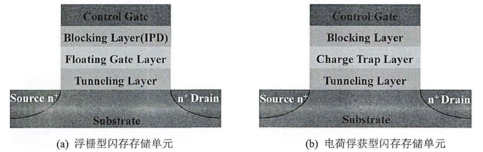
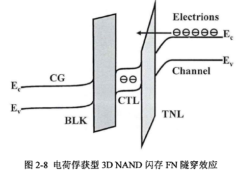

# 3D NAND Flash基本原理
##  1. 3D NAND Flash基础
###  1.1. 闪存存储单元
3DNAND Flash以存储单元（Cell）的阈值电压（Threshold Voltage,Vth）存储数据，阈值电压由存储在存储层的电荷数目决定。由于存储层两侧绝缘层的存在，代表数据的电荷不能随意向其他位置扩散，实现了非易失性存储的功能。

3DNAND Flash可以分为**浮栅型（FG）**和**电荷俘获型（CT）**，区别在于存储层的使用材料。

浮栅型3D NAND闪存存储单元存储层采用多晶硅材料，数据电荷可以在多晶硅导体带上自由移动，对氧化层的厚度和退化程度有敏感性。

电荷俘获型3D NAND闪存储存单元采用氮化硅，利用自身的深能级缺陷可以将存储的电荷牢牢俘获在缺陷内，且氮化硅是绝缘体，避免了浮栅型存储单元存在的敏感性问题。

因此，两种存储单元在阵列结构存在差异。浮栅型3D NAND单元与单元的存储层相互独立，电子俘获型3D NAND存储层相互连通。

电荷俘获型3D NAND已经成为主流，优势在于：

    - 1. 深能级缺陷俘获电子，单元性能相较于浮栅型受擦写循环影响退化平缓。
    - 2. 电荷俘获技术能够直面单元尺寸缩减的技术趋势。
    - 3. 存储层为绝缘体材料，改善了来自单元间的干扰效应。
###  1.2. 闪存系统与结构
3D NAND闪存的逻辑结构从大到小依次为：**Device,Target,Die,Plane,Block,Physical Page**。

    - Device：对外封装好的NAND芯片。
    - Target：拥有独立片选的单元，可以单独寻址。
    - Die/LUN：有独立封装的最小单元，从整片的半导体晶圆wafer上分割而来。
    - Plane：存储平面，拥有独立的寄存器，目前大多数厂商支持多Plane并行存取，该技术能够极大的提升闪存读写性能，降低功耗。
    - Block：阵列擦除的最小单元，物理页由若干个闪存存储单元组成。
    - Page：TLC NAND存储单元内信息比特映射到不同的页面，形成各种Page：Lower Page、Middle Page、Upper Page。

除了存储区域，外围电路也是闪存芯片重要构成，有CoA（CMOS outside Array）、CuA（CMOS under Array）、Wow（Wafer on Wafer）等。

3D NAND存在不同技术方案，根据堆叠方向可以分为两类：**沟道堆叠和栅极堆叠**，前者为垂直沟道，后者为水平沟道。栅极堆叠占多数。

栅极堆叠又可以分为先栅极和后栅极，BiCS和TCAT是这两种方法的代表性结构。

    - BiCS：多晶硅栅极，形成了SONOS（Silocon-Oxide-Sin-Oxide-Silicon）的单元结构，存储层形状类似于长方形条带。
    - TCAT：金属栅极，TANOS结构，存储层形状类似于模电中的方波信号。
    
TANOS:TaN-Al2O3-SiN-Oxide-Silicon

###  1.3. 3D NAND Flash基本工作方式
编程操作：可以理解为将目标数据对的阈值电压状态写入存储层的一个完整过程，在这个过程中，需要注意的有两处地方。一个是电荷实现位置变化的原理，即电荷如何进入存储层。另一个是编程方案，即存储单元的电荷量如何精确到达目标阈值电压状态。

**电荷实现位置变化的原理是Fowler-Nordheim（FN）隧穿效应。**浮栅和电子俘获型存储单元的编程操作都是通过FN隧穿效应实现的。借助施加的导通电压，低于势垒的电子到达另一侧。

编程电压施加方案：**增量步进脉冲编程**。FN隧穿效应实现了电荷位置变化，而为了将存储单元的阈值电压精确编至目标阈值电压状态，编程电压采取**ISPP**（Incremental Step-Pulse Programming）方案，即在编程操作期间，向目标存储单元施加一个幅值逐渐增大的电压脉冲，每一电压脉冲后紧跟一个校验脉冲，用以判定当前存储单元是否已编至目标阈值电压。若已到达，则停止对该单元下发新的编程脉冲，当施加的脉冲次数超过设定阈值仍无法通过校验，标志对该单元的编程失败。ISPP编程方案也决定了对存储单元编程时，只能向其编写更高的阈值电压，而要写入低于当前阈值电压的数据时，必须先执行擦除操作。

编程状态的阈值电压服从均匀分布。$[V_p,V_p+\Delta V_{pp}]$ 为其边界值。其中$V_p$和$\Delta V_{pp}$分别表示校验电压和编程步进增量电压。$V_p$和$\Delta V_{pp}$代表了第 k 个编程状态的阈值电压的边界，在数值上分别用$V_l^{(k)}$和$V_r^{(k)}$表示，则编程状态的阈值电压分布表示为下式所示：（$s_1=10,s_2=00,s_3=01$）。
$$p_{s_1|s_2|s_3}^{(k)}(x)=\frac{1}{\Delta V{pp}}, if V_l^{(k)}\leqslant x \leqslant V_r^{(k)}
$$
$$p_{s_1|s_2|s_3}^{(k)}(x)=0,else$$

但是均匀分布只是一种理想中的情况，当闪存没有噪声干扰时可以实现，但实际情况下，闪存存在各种噪声干扰，因此如上式所示的公式实际上并不够准确。

<figure class="half">
    
    
</figure>

**擦除操作**：最小单元是块，可以看作是编程的逆过程。擦除时，在擦除电压作用下，电子从存储层被排出至沟道，空穴进入存储层与原先存储的电子电中和后完成擦除操作。采用**ISPE**（Incremental Step-Pulse Erasing）实现，当超过一定次数后仍未将单元恢复至擦除状态，擦除操作失败。

可以近似将擦除状态的阈值电压分布类比为高斯分布，可以近似表示为下式所示，其中 $\mu_0$和$\sigma^2_{s_0}$分别表示均值和方差， $ s_0=11$。

$$p_{s_0}(x)=\frac{1}{\sigma_{s_0}\sqrt{2\pi}}e^{-\frac{(x-\mu_{s_0})^2}{2\sigma_{s_0}^2}}$$

**读操作**：对目标闪存单元访问时，其所在物理页控制栅（图中灰色区域）上施加一个读电压Vread，未选中的物理页控制栅施加导通电压Vpass，选通晶体管施加高电平打开。这里读操作的导通电压与编程时施加的导通电压大小并不一致，且读操作的导通电压要大于所有阈值电压中的最大值，从而确保同一NAND串（String）上未选中的存储单元处于导通状态。因为NAND闪存阵列的存储单元串联在位线上，所以可以通过位线电流判断存储单元的阈值电压，然后基于阈值电压可以判断存储单元的状态（数据）。对于SLC存储模式，在施加读电压后，若存储单元的阈值电压低于读电压，则存储单元的信息对应于数据“１”；若阈值电压高于读电压，则存储单元的信息对应于数据“０”。而对于MLC、TLC、QLC等拥有远超２种阈值电压状态的闪存单元来说，读取操作需要施加更多不同的判别电压才能将所有的阈值电压状态区分开来，进而判断出存储单元的数据。

###  1.4. 3D NAND Flash阈值电压
以TLC为例，存储的阈值电压共有8种，包括一个擦除和7个编程态，有8个格雷码与之对应，好处：阈值电压分布发生偏移后导致数据被错误地读取时，只会发生一位比特信息的翻转。

理想状态下，不同态的阈值电压分布不存在交叠部分，但阈值电压会由于各种因素发生展宽、变形和偏移，产生交叠。交叠部分会被下发的读取电压错误判定，如F部分右侧被判定为G态。

###  1.5. 3D NAND Flash可靠性问题
####  1.5.1. 耐久性
在阵列的每个单元上安全执行的最大数量的擦除与编程次数称为耐久性，一次擦除和一次编程操作记作一次擦写循环，两次擦写循环之间的时间间隔称为停留时间。

3D NAND不支持数据覆写，写入新的数据必须将旧数据擦除掉，擦写同时也会对存储单元带来损伤。擦写操作都有高电压（编程电压和擦除电压）的施加，并伴随电荷进出隧穿氧化层，擦写循环下，隧穿氧化层内部以及存储层与氧化层之间的界面处会生成新的缺陷，导致擦写效率降低。表现：写入时FN隧穿电流变大，编程时间下降；将阵列复原时，存储单元越难擦除至未写入状态，最坏的情况是对数据块的擦除失败。此外，擦写循环还会导致存储层生成更多的浅能级缺陷，加剧存储层电荷横向扩散从而造成电荷损失。

####  1.5.2. 干扰特性

