# MLC重复编程特性
MLC 闪存通过一个单元的四个状态表示两比特数据，这四种状态间的转化受到限制从而产生了与 SLC 单元不同的重复编程特性。MLC 闪存若想实现重复编程，主要面临两个问题:

    -1. MLC 单元状态转换限制，即存储单元的状态不再能够随心所欲的从 ‘1’ 变更为 ‘0’ 了.
    -2. 数据随机化存储的要求，为保证 MLC 单元耐久性，增加了一层随机化向量与用户数据进行异或操作，并将结果存储到阵列，随机化向量对芯片使用者透明，对写入到阵列上数据的不可知对重复编程也造成了很大困难。

## MLC单元状态转换限制
MLC 芯片为了避免额外的编程干扰，单元每次编程的阈值电压增量和当前比特状态都是严格限制的，不能像SLC一样进行状态的单项转换。

# MLC子页写入方法
## 两种SLC子页转换方案
闪存芯片支持使用两种方式进行 SLC 模式的转换。一种是通过**设置功能SET FEATURES**命令，另一种是通过**SLC模式使能SLC MODE ENABLE**命令。这两种命令拥有不同的阵列操作粒度和不同的开销。

**SET FEATURES**:负责设定一个晶圆（Die/LUN）中全部闪存阵列的工作模式。只有当想要设置的LUN空闲时（RDY=1，ARDY=1）时，才可以接收命令对阵列工作模式进行设置。其时序示意图如图2­12所示。
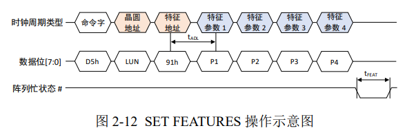
首先输入命令字 D5h，接下来的一个地址周期输入 LUN 编号。然后输入特征地址 91h，91h 对应的阵列功能是 SLC模式，除此之外还可以通过其他特征地址对应不同的阵列工作模式，例如 01h 对应时序模式设置，89h 对应读参考电压偏移（read retry）等等。输入特征地址后，经过短暂的时序从地址接收到数据接收（tADL，150ns），紧接着 4 个周期输入特征参数，用于定义一种模式下的具体工作参数。之后，LUN 阵列将处于忙碌状态 tF EAT（1µs），就完成了该 LUN 阵列在 SLC 模式和 MLC 模式间转换。这个开销相对于其他闪存阵列操作来说几乎是可以忽略不计的，但是该方法粒度太大。

**SLC MODE ENABLE**:是一种细粒度的阵列模式转换命令，能操控一个闪存块转换到SLC模式。流程示意图如下。
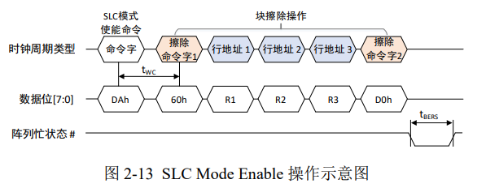
该命令首先输入命令字D5h，然后跟随着一个完整的闪存块擦除操作流程（60h­D0h），即输入第一个擦除命令字 60h，然后跟着三个行地址周期，最后是第二个擦除命令字 D0h。之后行地址指向的物理块所在 LUN 开始忙碌，持续 tBERS 时间（15ms）后擦除块内数据，并且该块转换到 SLC 模式。该方法细粒度转换便于管理，但是其超长的延时和数据擦除的方式则需要优化地管理。

## MLC、TLC读操作
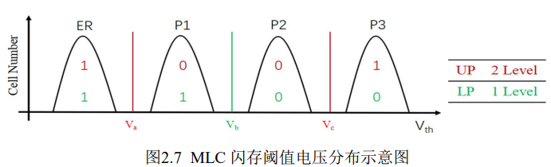

MLC一个单元需要存储两个比特，需要区分单元的四种状态:**P1-“01”、 P2-“00”、P3-“10”和 ER-“11”**，通常相邻的两个状态码的汉明距离为 1。

这两个比特被分成MSB和LSB，通常需要先利用一个参考电压$V_b$来获得LP的值，然后利用参考电压$V_a$和$V_c$来获得UP的值。

例如，如果MLC闪存的某个单元存储的数据为“01”，我首先利用$V_b$判断是否有导通电流，此时不会探测到这个电流，说明其LP为1，单元处于ER或P1状态，然后利用$V_a$来判断是否有导通电流，此时我们会探测到这个电流，UP为0，说明单元处于P1状态，其中存储的数据为“01”。

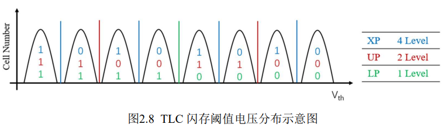

### 硬感知

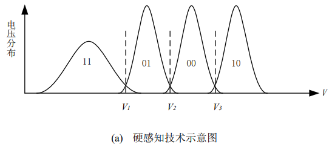

**硬感知**：相邻的两个阈值电压分布使用一个参考电压进行判断。如果电压$V>V_2$，则LP判断为“0”，否则判断为“1”。并根据LP数据判断的结果，进一步将实际电压$V与V_1或V_3$比较，以得到UP数据。

### 软感知
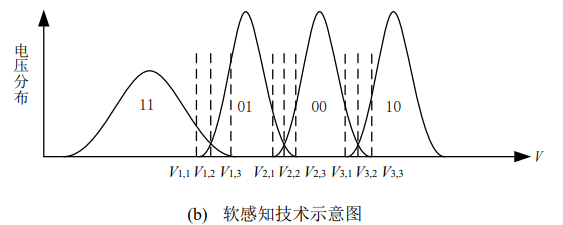

**软感知**：软感知在两个相邻的阈值电压分布间使用m个参考电压来提高读取数据的感测精度。$V_{i,j}$表示第$i$个电压重叠区域的第$j$个参考电压，$i\in [1,2,3],j\in [1,2]$。经过划分，存储单元电压分布被分为9个区间。

当读取存储单元数据时，通过实际电压$V$与阈值电压比较，确定电压$V$落入的区间，并根据区间信息计算出相应的似然比LLR值。假设存储单元实际电压$V$落入$[V_i,V_{i+1}]$区间内，且规定第$i$个等级电压分布为均值$\mu _i$、方差$\sigma _i^2$的高斯分布，则LP与UP的LLR值如下：

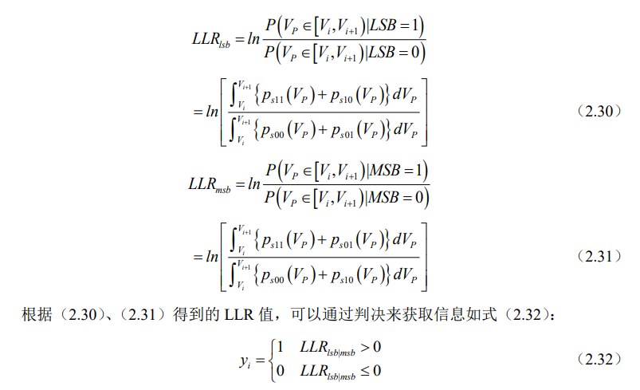

### TLC
TLC 的读取操作和MLC类似，由于TLC每个单元需要存储三个比特，区分 8 种状态，所以读取LP需要一个电压，UP需要两个电压，而XP需要四个，总共需要7个读电压。

## MLC、TLC写操作
FG 型闪存通过F-N隧穿效应从闪存单元中注入电子，从而写入数据。写入数据时，控制级CG上施加一个高电压，沟道氧化物上产生了一个高电场，源极S施加一个导通电压，漏极D接地，晶体管导通，电子进入浮栅中，浮栅晶体管的阈值电压提高。

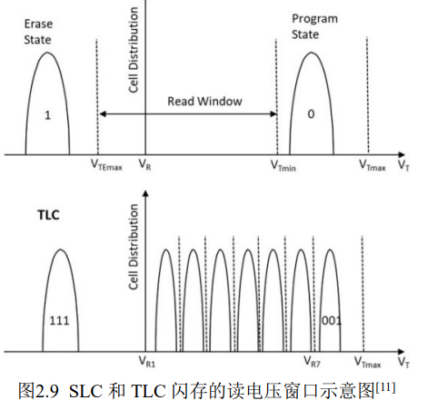
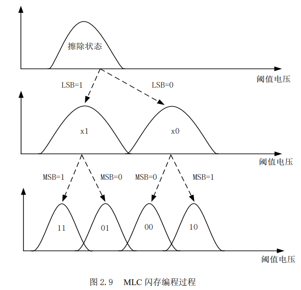

### ISPP
为了能够给一个目标单元写入正确的数据，需要给这个单元所在的位线上的所有其他单元的控制级施加一个导通电压$V_{pass}$，与此同时，使用**ISPP**法来控制施加在目标单元控制级上的电压$V_{CG}$。如图。

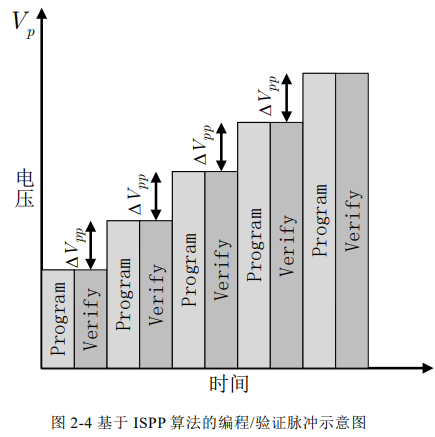

使用 ISPP 方法写入数据时，使用一个短暂的写电压脉冲$V_{program}$注入电子提高阈值电压，然后用验证电压$V_{verify}$来检查这个单元的阈值电压是否达到预期电压$V_p$。如果当前电压$V_{th}$低于预期电压$V_p$，则重复编程和验证过程。迭代编程严格保证每次对存储单元增压$\Delta V_{pp}$。

ISPP 重复这两步直到闪存单元达到目标电压，之后在相应位线上施加高电压抑制当前单元的编程，当一条字线上只有部分单元的电压达到合适范围时，ISPP会将这些单元所在字线的SSL关闭。

### 2-PASS、三步写
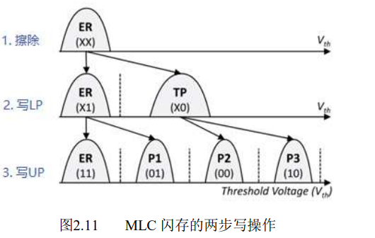

**MLC**:两步就是先写LP，再写UP。写LP时，将基于其值将单元写道P1与P2中间的TP状态（值为“0”）或保持在ER状态（值为“1”）；在写UP值前，LP数据会被读取到内部的寄存器中，用以确定单元的当前状态；最后根据UP值和当前单元电压用一个脉冲电流将单元写入到合适的状态。

**TLC**:如上图。采用foggy-fine programming的2-PASS写入方法，与上述方法类似。首先写入LP，然后根据UP和XP的值对单元进行写入操作；由于$V_{th}$的窗口值变小，容易产生写入错误，所以在最后一步中，先前写入的数据会被读取到SLC缓存，根据读取的结果采用较小的脉冲电流进行最后的精调。

由于一个物理页包含多个逻辑页，存在只有部分逻辑页写入了数据的状态。可以在带外区存储每个物理页的写入状态，并在写入逻辑页面时先获取物理页的写入状态，一个TLC物理页只需要一个额外的TLC单元就可以实现写入状态的存储。

## MLC、TLC擦除操作
进行擦除操作时CG接地，衬底施加一个高电压$V_{erease}$，电子从 FG 中被抽取出来，单元进入ER状态。

由于沟道氧化物中存在电荷陷阱，会影响擦除操作的效果，通常的做法是在衬底上施加多次正偏置电压来保证不会出现擦除错误。由于一个块上的全部单元共享一个衬底，所以块是执行擦除操作的最小单位。