## TLC擦除操作
### 单个
原理：隧穿效应

浮栅晶体管的控制栅极需要加上0V电压，同时在浮栅晶体管的衬底上施加较高的擦除电$V_{erase}$，这样电子就会通过Fowler-Nordheim隧穿效应从浮动栅极穿过隧道氧化层释放，实现存储单元数据的“擦除”。只有在存储单元中数据擦除完成之后，才能再一次向该存储单元编程写入数据.

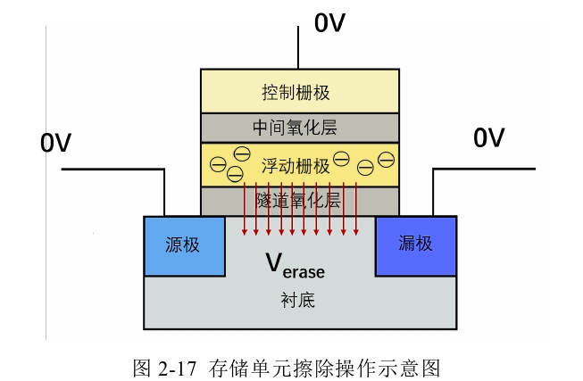

### 闪存阵列
在进行擦除操作时，需要对整个物理块中所有字线的控制栅极上施加0V电压，对衬底施加高擦除电压$V_{erase}$，同时保持源极选择晶体管、漏极选择晶体管还有位线处于悬空状态。此时，由于衬底和浮动栅极之间高电位差的缘故，电子可以通过浮动栅极注入到衬底之中，实现浮动栅极内部电子的释放。

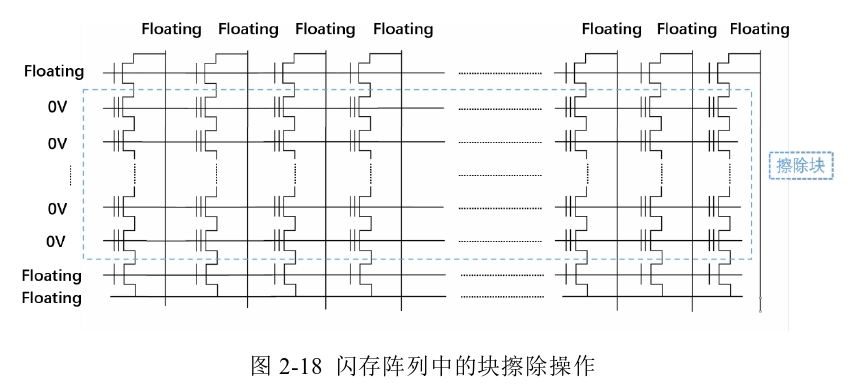

## TLC读操作
*参考知乎 https://zhuanlan.zhihu.com/p/640890763*

### 单个
对于TLC NAND，每个存储单元存储3bit信息，有8种状态，因此对于存储单元内数据的判断还需要更精细地判断存储单元内电子数量的多少。存储单元内电子数量的多少，通过对浮栅晶体管中阈值电压状态的测量可以判断:
$$V_{th}=V_{thi}+(-Q_{FG})/C_{pp}$$

其中，$V_{th}$为存储单元编程后阈值电压，$V_{thi}$为存储单元初始阈值电压，$Q_{FG}$为浮栅晶体管内电荷量，$C_{pp}$为极间电容。

#### 传统读取
就TLC而言，由于有8个Vt状态，需要7次比较才能把三个页(LP、MP、UP)都读出来。TLC如果沿用SLC到MLC的思路，将这7次比较分配为：LP比较1次，MP比较2次，UP比较4次。

**缺点**：读取性能势必会被UP的超长延迟所牵制，且UP的读干扰也会数倍于LP。

#### TLC 2-3-2读取

分配7次比较时：LP用两个比较电压，比较两次；MP用三个比较电压，比较三次；UP用两个比较电压，比较两次。

**优点**：降低最高比较次数，平衡各个page的读取。

**实现方式**：格雷码。

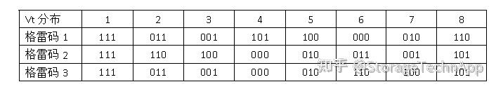

格雷码1就是典型的1-2-4编码，格雷码2和3都是2-3-2编码。为了支撑TLC三个page的读平衡，可以使用格雷码2或者格雷码3。

### 阵列

在进行读操作时，连接位线的漏极选择晶体管和连接源线的源极选择晶体管打开，在需要进行读取的物理页对应字线的控制栅极加上读电压Vgate，同时对同一阵列的其他字线的控制栅极加上一个较高的导通电压Vpass，使得其他字线晶体管都导通。通过改变需要读取的物理页对应字线的控制栅极上的读电压Vgatc，以及位线和源线之间有无电流产生，就可以判断物理页存储的数据情况。

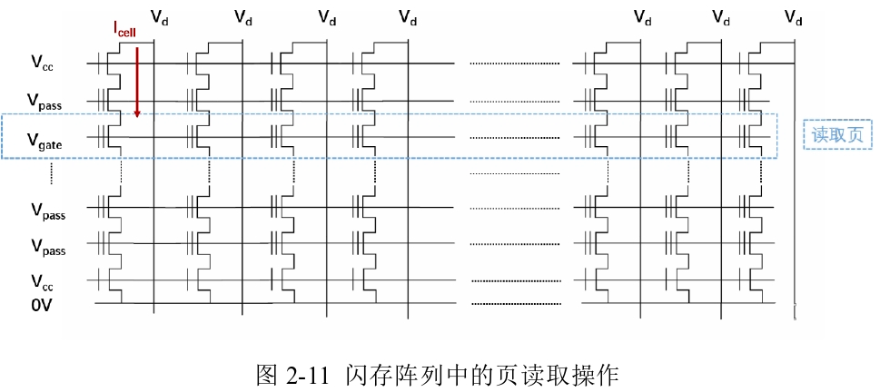

## TLC编程操作
### one shot编程
即Incremental Programming，很典型的ISPP Procedure。

适用于电荷俘获型3D NAND.

*可以参考“MLC、TLC读写擦除原理.md”中的ISPP的解释*

过程：

    1.编程脉冲：通过一系列小的编程脉冲逐步增加闪存单元的电压。每个脉冲会使电压略微增加，确保电压水平能够精准地达到目标范围内。
    2.状态读取：每次脉冲后，读取单元的电压状态。如果电压未达到目标范围，则继续施加更多的脉冲，直到电压在正确的两个阈值之间。
    3.结果：最终，每个比特单元被编程到精确的电压水平，形成理想的电压分布。
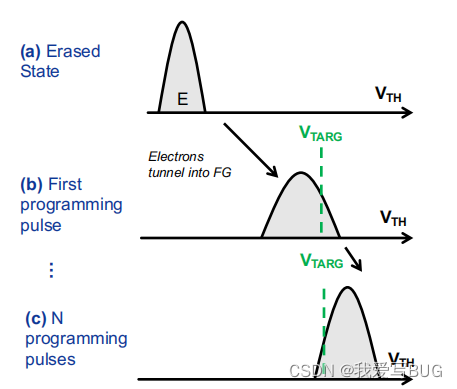

初始状态：
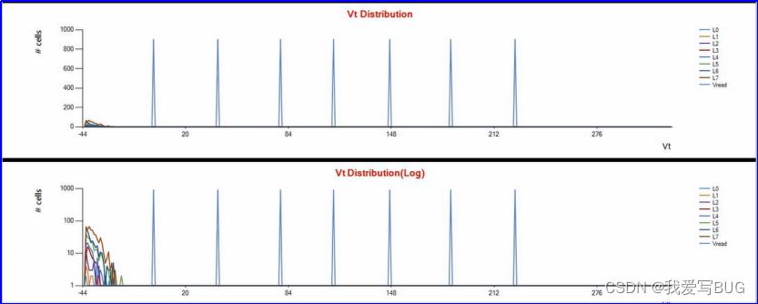
过程：
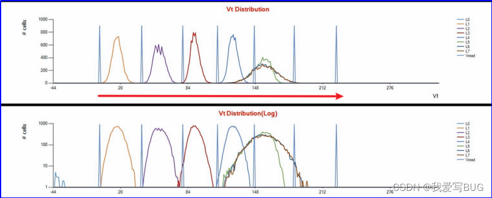
最后：
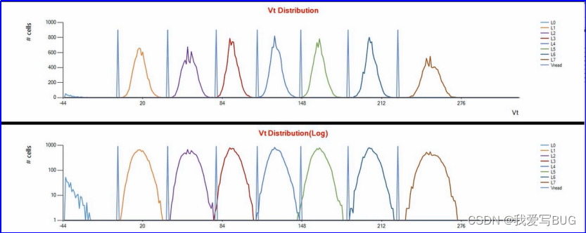

### two pass编程
two pass编程方式必须先编完LSB再编CSB和MSB。

适用于浮栅型3D NAND.

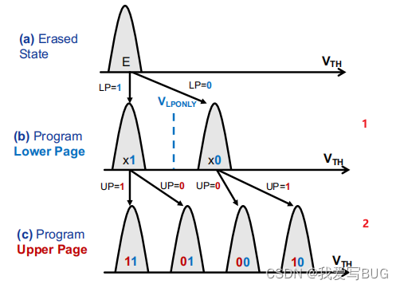

### 4-8型
4-8型Two-Pass编程通过预编程到4个电压水平，然后精确调整到8个电压水平，适用于对电压精度要求较高的应用。

    1.编程脉冲：通过一系列小的编程脉冲逐步增加闪存单元的电压。每个脉冲会使电压略微增加，确保电压水平能够精准地达到目标范围内。
    2.状态读取：每次脉冲后，读取单元的电压状态。如果电压未达到目标范围，则继续施加更多的脉冲，直到电压在正确的两个阈值之间。
    3.结果：最终，每个比特单元被编程到精确的电压水平，形成理想的电压分布。

### 2-8型
2-8型Two-Pass编程通过预编程到2个电压水平，然后分阶段精确调整，适用于较为复杂的电压分布需求。

    1.预编程：首先将闪存单元预编程到两个初始电压水平。这一过程主要针对那些将被编程到较高电压水平（L4-L7）的单元，将它们预编程到L3和L4之间的电压水平。
    2.精确编程：随后将预编程的单元调整到最终的较高电压水平（L4-L7），同时将其余单元编程到较低电压水平（L1-L3）。
    3.结果：所有单元最终被编程到精确的电压水平，形成理想的电压分布。

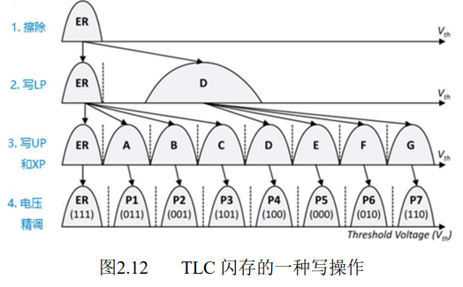

### one shot和two pass对比
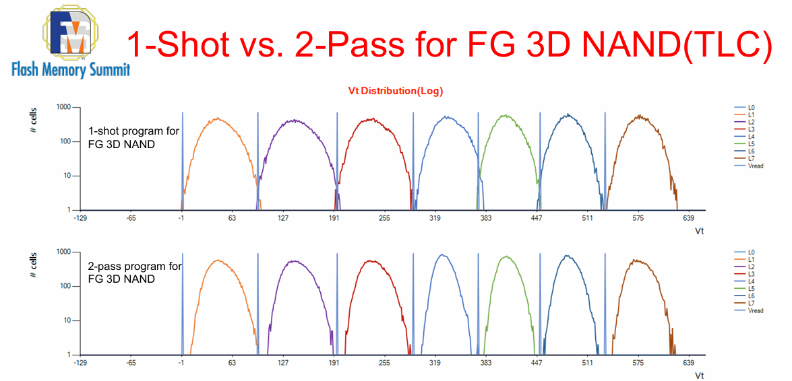

one shot较为简单，适用于需要较快编程速度的场景，但电压分布的精度可能较低，容易导致误差。

two pass由于分阶段进行，编程精度较高，可以减少误差，提高数据可靠性，但编程过程较为复杂，速度较慢。

**two pass缺点**：

The possibility of introducing HRE（High Reliable Error） is the 
key shortcoming of 2-Pass program, which is especially harmful 
for LDPC soft bit decode.

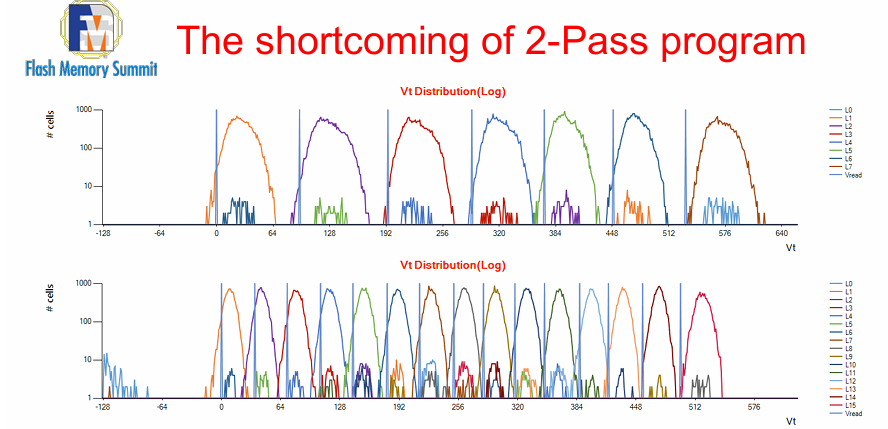

原因：The reason is the second pass program have to read the result of first pass programed data, which will introduce some bit errors. These bit errors will be expanded by the second pass 
program operation.

解决方案：The solution is re-inputting the first-pass data for second pass program, instead of reading from the first programed

改进后的re-input型：
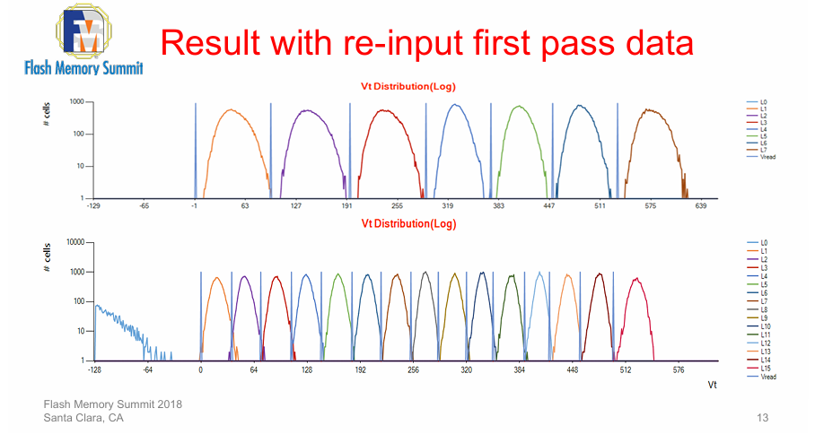

