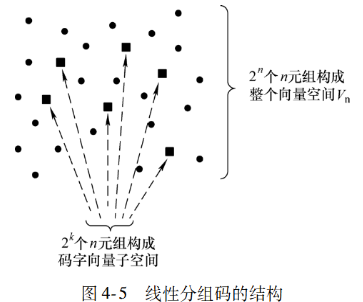

- [线性分组码](#线性分组码)
  - [差错控制系统](#差错控制系统)
    - [差错控制的方式：](#差错控制的方式)
    - [信道编码的分类](#信道编码的分类)
    - [分组码的基本概念](#分组码的基本概念)
    - [分组码的译码准则](#分组码的译码准则)
  - [线性分组码](#线性分组码-1)
    - [线性分组码的结构](#线性分组码的结构)
    - [生成矩阵](#生成矩阵)
    - [系统的线性分组码](#系统的线性分组码)
    - [监督矩阵](#监督矩阵)
    - [伴随式校验](#伴随式校验)
    - [错误纠正](#错误纠正)
  - [线性分组码的检错和纠错能力](#线性分组码的检错和纠错能力)
  - [循环码](#循环码)
    - [循环码的定义和基本性质](#循环码的定义和基本性质)
    - [循环码的生成多项式](#循环码的生成多项式)
    - [循环码的监督多项式](#循环码的监督多项式)
    - [循环码的生成矩阵及系统的循环码](#循环码的生成矩阵及系统的循环码)

## 线性分组码
### 差错控制系统
#### 差错控制的方式：

1. **重传反馈方式**：译码器判决有无错误产生，将判决结果传递给发送端，发送端根据判决信号，再次传递有错的信息。**优点**：编译码设备简单，纠错能力极高，适用于干扰特别复杂的信道。
2. **向前纠错方式**：接收端自动发现并纠正一定范围内的错误。
3. **混合方式**：纠错码能力内则自动纠错，超出能力则要求发送端重新传输。

#### 信道编码的分类
对于纠错码：

根据消息符号处理方式的不同:

1. **分组码**：k个消息符号，生成r个校验符号附在消息符号后，最后输出长度为$n=k+r$个符号的码字。**每个码字的校验符号至于自身的消息符号有关**。用$(n,k)$表示，$n$表示码长，$k$表示其中消息符号的个数。
2. **卷积码**：用$n、k$和$K$三个整数描述。其中的$n-k$个校验符号不仅与当前的消息符号有关，还与之前$K-1$个消息符号分组有关，**具有记忆性**。

按照校验码元与消息码元之间的关系：

1. **线性码**：校验符号与消息符号之间的关系是线性关系（满足线性叠加原理）
2. **非线性码**：分析困难，实现复杂，理论体系尚不完整。

根据分组码中码字的结构特点，又可以分为循环码与非循环码。

#### 分组码的基本概念
**码率**：$R=\frac {k}{n}$

**汉明重量**：码字$z = (z_1, z_2, …, z_{n-1}, z_n)$ 中非零符号的个数称为该码字的汉明重量（Hamming Weight），简称重量，用$w(z)$来表示。两个$n$长的码字$x = (x_1, x_2, …, x_{n-1}, x_n) 和 y = (y_1, y_2, …, y_{n-1}, y_n)$之间对应位置取值不同的个数称为两个码字之间的汉明距离（Hamming Distance），简称距离，用$d(x, y)$来表示。

对于二进制分组码而言，两个码字之间的汉明距离实际上就是两个码字模 2 加（异或）结果的汉明重量，即
$$ d(x,y) = w(\text{xor}(x,y)) = w(x \oplus y) $$
#### 分组码的译码准则
在数字通信系统的接收端，信道译码器在收到接收向量 $r$ 之后，需要进行译码从而得到发送码字向量 $c_i$ 的估计结果。利用检测与估计算理，可以证明信道译码器的最优译码准则是最大后验概率率译码，该准则在发送码字先验等概的前提下等效于最大似然译码（MLD，Maximum Likelihood Decoding）准则，即将 $r$ 译码为
$$ c_i = argmaxPr\left\{r|c_i\right\} $$
式中 $C$ 是由所有许用码字构成的集合。

       对于离散无记忆信道（Discrete Memoryless Channel、DMC），只要错误转移概率 $p<0.5$，则最大似然译码准则会等效于最小距离译码（Minimum Distance Decoding，MDD）准则，即将 $r$ 译码为
$$ c_i = argmin d(r,c_i) $$
因为对于接收向量 $r$，如果其与 $C$ 中某一码字向量 $c_i$ 之间的汉明距离记为 $d$，即
$$ d(r,c_i)=d $$
则
$$ Pr\left\{r|c_i\right\}=p^d(1-p)^{n-d}=(1-p)^n\left(\frac{p}{1-p}\right)^d $$
由上式显然可知，只要 $p<0.5$，则 $Pr\left\{r|c_i\right\}$ 是 $d$ 的单调递减函数，因此只要找到 $d=d_{min}$的那个码字向量 $c_i$，便是能使 $Pr\left\{r|c_i\right\}$ 最大的译码结果。
### 线性分组码
#### 线性分组码的结构
向量空间 $V_n$ 的一个子集 $S$ 如果满足下列两个条件，则称 $S$ 为 $V_n$ 的一个子空间：

1）$S$ 中包含全零向量。

2）$S$ 中任意两个向量的和仍然在 $S$ 内（封闭性质）。

假设 $V_i$ 和 $V_j$ 是某（$n$，$k$）二进制分组码中的两个码字向量，则该（$n$，$k$）码**是线性码的充要条件**是 $V_i + V_j$ 也为该码的许可码字向量。**线性分组码构成一个子空间**，该子空间之外的向量不能通过许可码字向量（子空间中的元素）的加法运算来得到。

**总之，$2^k$ 个 $n$ 元组构成的一个（$n$，$k$）线性分组码的充要条件是该集合 $C$ 为向量空间 $V_n$ （包括所有的 $n$ 元组）的一个子空间**。这样，对于二进制编码而言，线性分组码是由 $2^k$ 个长度为 $n$ 的二进制向量组成的码字集合 $C$，且对于任意两个码字向量 $c_1$，$c_2 \in C$ 均有 $c_1 + c_2 \in C$，显然零向量 $\mathbf{0}$ 将会是任意线性分组码中的一个合法码字向量。由式（4-1）可知 $d(c_1，c_2)=w(c_1+c_2)$，而 $c_1 + c_2$ 也是一个合法码字，于是对于线性分组码而言，码字重量和码字之间的距离存在一一对应的关系。

对于线性分组码 $C$，定义所有非零码字中重量的最小区为该码的最小重量 $w_{min}$，即
$$ w_{min} = minw(c) \qquad \text{where } c \neq 0  $$

显然，线性分组码的最小重量与最小码距相等，即 $w_{min}=d_{min}$。

如上图，如果该扰乱后的向量不是太不像发送的许用码字（离发送码字的方点不是太远），译码器便能进行正确的译码。

由此编码原则：

1. 向量空间$V_n$中安排尽可能多的码字向量，减少冗余。
2. 码字之间的距离要尽可能远。

#### 生成矩阵
因为一个线性分组码的码字集合是二进制 $n$ 维向量空间的一个 $k$ 纤维空间（$k < n$），所以通常可以找到少于 $2^k$ 个的 $n$ 元组构成的集合，该集合中的向量可以生成所有的 $2^k$ 个码字，此时称这些向量张成了一个子空间，张成该子空间的最小线性独立集合称为子空间的基，而其中包含的向量个数称为子空间的维数。由 $k$ 个线性独立的 $n$ 元组向量 $V_1$，$V_2$，…，$V_k$ 组成的一个基，因为每一个码字都是 $V_1$，$V_2$，…，$V_k$ 的线性组合，所以可以使用这些向量来生成所需的线性分组码，即 $2^k$ 个码字中的每一个码字均可以表示
$$ U = m_1V_1 + m_2V_2 + \cdots + m_kV_k $$
式中，$m_i$（取值为 0 或 1）为消息比特，$i = 1，2，\ldots，k$。

通常，可以把下述 $k \times n$ 矩阵定义为生成矩阵
$$ G =
    \begin{pmatrix}
      V_1 \\
      V_2 \\
      \vdots \\
      V_k
    \end{pmatrix}
    =
    \begin{pmatrix}
      v_{11} & v_{12} & \cdots & v_{1n} \\
      v_{21} & v_{22} & \cdots & v_{2n} \\
      \vdots & \vdots & \ddots & \vdots \\
      v_{k1} & v_{k2} & \cdots & v_{kn}
    \end{pmatrix}
$$
而由 $k$ 个比特组成的消息序列可以表示为如下行向量
$$ m = 
    \begin{pmatrix}
      m_1 \\
      m_2 \\
      \vdots \\
      m_k
    \end{pmatrix}
$$
这样，码字向量 $c = (c_1，c_2，\ldots，c_n)$ 可以通过 $m$ 和 $G$ 的相乘来得到，即
$$c=mG$$
码字向量是生成矩阵$G$行向量的线性组合。因为一个线性分组码可以由其生成矩阵$G$来完全确定，因此编码器仅需要存储$G$的$k$个行向量，不必存储所有的$2^k$个码字向量。
#### 系统的线性分组码
系统线性分组码（$n$，$k$）是指生成的码字向量中有连续 $k$ 位的内容与消息向量完全一样，剩下的 $n - k$ 位表示校验比特。系统线性分组码的生成矩阵具有如下形式
$$ G = \begin{bmatrix} P \\ I_k \end{bmatrix} = \begin{bmatrix} p_{11} & p_{12} & \cdots & p_{1(n-k)} & 1 & 0 & \cdots & 0\\ p_{21} & p_{22} & \cdots & p_{2(n-k)} & 0 & 1 & \cdots & 0\\ \vdots & \vdots & \ddots & \vdots & \vdots & \vdots & \ddots & \vdots\\ p_{k1} & p_{k2} & \cdots & p_{k(n-k)} & 0 & 0 & \cdots & 1 \end{bmatrix} $$

式中，$P$ 是生成矩阵的校验阵列部分部分，$I_k$ 是 $k \times k$ 的单位矩阵，$p_{ij}=0$ 或 $1$，$i=1，2，\ldots，k$，$j=1，2，\ldots，n-k$。通过使用这种系统形式的生成矩阵，可以进一步减小程序编码器的复杂性，因为此时不再需要存储生成矩阵中单位矩阵（即 $I_k$）的部分。

将上式代入$c=mG$，得系统的码字生成公式：

所以可得
$$ c_i = \begin{cases} m_1p_{1i} + m_2p_{2i} + \cdots + m_kp_{ki}, & i = 1, 2, \ldots, (n-k)\\ m_{i-n+k}, & i = (n-k+1), \ldots, n \end{cases} $$
于是
$$ c = (\underbrace{c_1, c_2, \ldots, c_n}_{校验比特}) = (\underbrace{p_1, p_2, \ldots, p_{n-k}}_{校验比特}, \underbrace{m_1, m_2, \ldots, m_k}_{消息比特}) $$
#### 监督矩阵
接下来讨论线性分组码的监督矩阵（Parity – Check Matrix）$H$，它可以用来译码。对于每个 $k \times n$ 的生成矩阵 $G$，一定存在一个 $(n-k) \times n$ 的矩阵 $H$，该矩阵的行向量与生成矩阵 $G$ 的行向量正交，即
$$ GH^T = 0  $$
式中，$H^T$ 是 $H$ 的转置矩阵，$0$ 是一个 $k \times (n-k)$ 的全零矩阵。于是，对于该码的任意一个码字 $c$，均有
$$ cH^T = mGH^T = 0  $$
式中，$0$ 是一个 $1 \times (n-k)$ 的全零向量。上式可以用来检验一个接收向量是否为一个合法的码字：判断码字 $c$ 是否由矩阵 $G$ 生成的充要条件为 $cH^T = 0$。

对于生成矩阵为 $G = [P \; I_k]$ 的系统码而言，为了保证与生成矩阵 $G$ 正交，监督矩阵 $H$ 显然应具有如下结构
$$ H = \left[ \begin{array}{cc} I_{n-k} & P^T \end{array} \right]  $$

判断一个向量 $c$ 是否为一个合法码字的充要条件为 $cH^T = 0$。假如选择 $c$ 是具有最小重量 $w_{min}$（或 $d_{min}$）的码字，那么由关系式 $cH^T = 0$ 可知监督矩阵 $H$ 中有 $d_{min}$ 列是线性相关的；另一方面，由于没有重量小于 $d_{min}$ 的码字，所以 $H$ 中不可能会有少于 $d_{min}$ 列是线性相关的。因此，$d_{min}$ 等于 $H$ 中线性相关的列向量的最小数目，**也就是说 $H$ 的列空间是 $d_{min}-1$ 维的**。
#### 伴随式校验
对于编码器输出的一个码字 $c = (c_1, c_2, \ldots, c_n)$，在传输过程中某些位可能会出错，这样经过信道传输后的接收向量 $r = (r_1, r_2, \ldots, r_n)$ 可以表示为
$$ r = c + e \tag{4-24} $$
式中，$e = (e_1, e_2, \ldots, e_n)$ 表示信道传输引起的错误向量，称为错误图样（Error Pattern）。

对于接收向量 $r$，译码器为了进行校验会计算其伴随式（Syndrome）。定义下面的 $1 \times (n-k)$ 向量 $s$ 为对应于 $r$ 的伴随式：
$$ s = rH^T \tag{4-25} $$

伴随式是对 $r$ 执行监督校验的结果，用來确定 $r$ 是否为一个合法码字：如果 $r$ 是一个合法码字，则其对应的伴随式 $s = 0$；如果 $r$ 中包含可检测到的错误，则其对应的伴随式 $s$ 中会有非零元素值；如果 $r$ 中包含可纠正的错误，则其伴随式 $s$ 中会有特殊的非零值来标记特定的错误图样。

将式（4-24）代入式（4-25），可得
$$ s = rH^T = (c + e)H^T = eH^T \tag{4-26} $$
上式表明在伴随式校验中，由受扰码字向量 $r$ 或对应的错误图样 $e$ 得到的伴随式是一样的。线性分组码有一个重要的性质（译码的基础）：可纠正的错误图样和伴随式是一一对应的。

利用上式，可知监督矩阵 $H$ 应具有下列两个重要性质：

1）监督矩阵 $H$ 的列向量不能有全零向量。否则，在对应的码字位置发生的错误不会改变伴随式，故该种错误不能检测到。

2）监督矩阵 $H$ 的所有列向量必须彼此不同。否则，如果 $H$ 中的两列是相同的，则发生在这两个对应位置的错误将是不可区分的。
#### 错误纠正

下面介绍用标准数组（Standard Array）纠错的概念。对于一个 $(n, k)$ 码，标准数组是由所有 $2^n$ 个可能的 $n$ 比特长的接收向量组成的 $2^k$ 列 $2^{n-k}$ 行的数组，它的结构如下：第一行由所有的合法码字构成，其中第一个元素为全零码字；第一列包含所有可纠正的错误图样；每一行称为一个陪集（Coset），每行的第一个元素表示一个错误图样，称为陪集首（Coset Leader），每行后面的元素都是合法码字被该行陪集首扰乱后的接收向量。标准数组的结构可以用下表来描述。

| $c_1 = e_1 = 0$ | $c_2$ | … | $c_i$ | … | $c_{2^k}$ |
| --- |  --- | --- | --- | --- | --- |
| $e_2$ | $c_2 + e_2$ | … | $c_i + e_2$ | … | $c_{2^k} + e_2$ |
| $e_3$ | $c_2 + e_3$ | … | $c_i + e_3$ | … | $c_{2^k} + e_3$ |
| $\vdots$ | $\vdots$ | $\vdots$ | $\vdots$ | $\vdots$ |
| $e_j$ | $c_2 + e_j$ | … | $c_i + e_j$ | … | $c_{2^k} + e_j$ |
| $\vdots$ | $\vdots$ | $\vdots$ | $\vdots$ | $\vdots$ |
| $e_{2^{n-k}}$ | $c_2 + e_{2^{n-k}}$ | … | $c_i + e_{2^{n-k}}$ | … | $c_{2k} + e_{2^{n-k}}$ |

如果 $e_j$ 是第 $j$ 个陪集的陪集首（即错误图样），则 $c_i + e_j$ 将会是该陪集中的一个 $n$ 元组，该 $n$ 元组的伴随式为
$$ s = (c_i + e_j)^TH^T = c_iH^T + e_jH^T  $$
由于$c_iH^T=0$，所以上式变为
$$s = e_jH^T$$
因此，陪集中的每一个元素均有相同的伴随式，不同陪集的伴随式不同。

**纠错译码的步骤如下**：

1） 计算接收向量 $r$ 的伴随式 $s=rH^T$。

2） 从标准数组中找到某个陪集首（错误图样）$e_j$，使得其伴随式 $e_jH^T$ 也等于 $s$。

3） 利用式子 $c = r + e_j$ 将接收向量 $r$ 纠正为合法码字 $c$。
### 线性分组码的检错和纠错能力
为了求得线性分组码的最小码距，只需要找到所有合法码字（全零码字除外）中汉明重量最小的那个码字，其重量便是该码的最小码距 $d_{min}$。

容易证明，对于一个最小码距为 $d_{min}$ 的（$n$, $k$）线性分组码，关于其检错和纠错能力有如下结论：

1） 如果该码只用于纠错，可以确保能够纠正的错误位数最多为
$$ t = \left\lfloor \frac{d_{min}-1}{2} \right\rfloor  $$
2） 如果该码只用于检错，可以确保检测出的错误位数最多为
$$e=d_{min}-1$$
对于（$n$, $k$）线性分组码，令 $A_j$ 表示重量为 $j$ 的码字数量，则称 $A_0$, $A_1$, …, $A_n$ 为该码的重量分布（Weight Distribution）。假如该码仅用于检错并通过二进制对称信道传输，可以证明译码器不能检测出错误的概率为
$$ P_{nd} = \sum_{j=1}^{n} A_j p^{j}(1-p)^{n-j} $$
式中，$p$ 是错误转移概率。此外，如果该码的最小码距为 $d_{min}$，那么显然从 $A_1$ 到 $A_{d_{min}-1}$ 的值都是 $0$。

3） 如果该码同时用于纠正 α个错误、检测 β个错误 （β≥α），则要求
$$d_{min}\geqslant \alpha + \beta +1 $$
### 循环码
#### 循环码的定义和基本性质
**循环码是具有如下循环移位性质的线性分组码**：

循环码是具有如下循环移位性质的线性分组码：如果 $c=(c_{n-1}, c_{n-2}, \cdots, c_1, c_0)$ 是某循环码的一个码字，则 $c$ 中元素在经过一次循环移位后得到的向量 $(c_{n-2}, \cdots, c_1, c_0, c_{n-1})$ 仍是该码的一个码字。重复上述过程可知，码字 $c$ 的所有循环移位仍是码字。由于循环移位性质的存在，相比于普通的线性分组码，循环码**具有额外的可用于简化编码和译码运算**的结构特点，利用这些特点可以在码字较多的前提下实现码长较大的分组码。

在研究（$n$, $k$）循环码的代数结构时，更方便的方法是将码字向量 $c=(c_{n-1}, c_{n-2}, \cdots, c_1, c_0)$ 表示成如下的码字多项式：
$$ c(X) = c_{n-1}X^{n-1} + c_{n-2}X^{n-2} + \cdots + c_1X + c_0  $$
对于某循环码的一个码字向量 $c=(c_{n-1}, c_{n-2}, \cdots, c_1, c_0)$，若其码字多项式为 $c(X)$，则 $X^ic(X)\mod(X^n+1)$ 也表示该循环码的一个码字多项式，该关系可以表示为
$$ X^ic(X)=Q(X)(X^n+1)+c^{(i)}(X) $$
式中，$Q(X)$ 是商式（由$i$确定的未知量）；而余式 $c^{(i)}(X)$ 表示该循环码的一个码字多项式，它对应码字向量 $c$ 循环移位 $i$ 次后得到的码字向量 $c^{(i)}$。
#### 循环码的生成多项式
循环码可以利用生成多项式（Generator Polynomial）来生成。（$n$, $k$）循环码的生成多项式是 $X^n+1$ 的一个因式，且阶为 $n-k$，故可以表示为
$$ g(X) = X^{n-k} + g_{n-k-1}X^{n-k-1} + \cdots + g_1X + 1 \tag{4-43} $$

对应于消息向量 $m=(m_{k-1}, m_{k-2}, \cdots, m_0)$ 的消息多项式可以定义为
$$ m(X) = m_{k-1}X^{k-1} + m_{k-2}X^{k-2} + \cdots + m_1X + m_0 \tag{4-44} $$
这样，$m(X)g(X)$ 是一个不大于 $n-1$ 阶的多项式，可以表示一个码字多项式。

（$n$, $k$）循环码共有 $2^k$ 个消息多项式，通过一个给定的 $g(X)$ 可以生成对应的全部 $2^k$ 个码字多项式，即
$$ c_i(X) = m_i(X)g(X) \tag{4-45} $$

接下来证明由上式得到的码字多项式满足循环性质：假设 $c(X)$ 表示由上式得到的任意一个码字多项式，则其循环移位 1 次后可得
$$ c^{(1)}(X) = Xc(X) + c_{n-1}(X^n+1) \tag{4-46} $$
又因为 $g(X)$ 可以整除 $X^n+1$ 和 $c(X)$，所以也可以整除 $c^{(1)}(X)$，从而可知 $c^{(1)}(X)$ 也是一个码字多项式。

实际上，仅当存在可以整除 $X^n+1$ 且阶为 $n-k$ 的多项式 $g(X)$ 时，（$n$, $k$）循环码才存在。因此，设计一个循环码的过程等价于对 $X^n+1$ 进行因式分解的问题。
#### 循环码的监督多项式
假设 $g(X)$ 是（$n$, $k$）循环码的生成多项式，这样 $g(X)$ 就是 $X^n+1$ 的一个因式，所以
$$ X^n+1 = g(X)h(X) \tag{4-47} $$
式中，$h(X)$ 是一个阶为 $k$ 的多项式，称为该码的监督多项式。

监督多项式 $h(X)$ 可以用来生成对偶码。定义 $h(X)$ 的互反多项式为
$$ X^kh(X^{-1}) = X^k(X^{-k} + h_{k-1}X^{-k+1} + h_{k-2}X^{-k+2} + \cdots + h_1X^{-1} + 1) \tag{4-48} $$
$$ = 1 + h_{k-1}X + h_{k-2}X^2 + \cdots + h_1X^{k-1} + X^k $$
显然，互反多项式也是 $X^n+1$ 的一个因式，所以 $X^kh(X^{-1})$ 是（$n$, $n-k$）循环码的生成多项式，该码是由 $g(X)$ 生成的（$n$, $k$）循环码的对偶码。注意（$n$, $n-k$）对偶码构成（$n$, $k$）循环码的零空间（即他们都是正交的）。
#### 循环码的生成矩阵及系统的循环码
对于线性分组码，其生成矩阵可以用任意 $k$ 个线性独立的码字向量来构造。如果已知某循环码的生成多项式为 $g(X)$，那么最容易找到的 $k$ 个线性独立的码字向量分别是对应于 $X^{k-1}g(X)$，$\cdots$，$X^2g(X)$，$Xg(X)$，$g(X)$ 等多项式的码字向量，所以可以定义
$$ G(X) = \begin{pmatrix}
X^{k-1}g(X) \\
\vdots \\
X^2g(X) \\
Xg(X) \\
g(X)
\end{pmatrix} \tag{4-49} $$
这样，用 $G(X)$ 中各个行多项式的系数来充当行向量便可以最后得到该码的生成矩阵 $G$。

因为任何不高于 $n-1$ 阶且能被 $g(X)$ 整除的多项式都可以表示成上述 $k$ 多项式的线性组合，所以上面 $k$ 多项式构成的集合是一个 $k$ 维的基，进而可知与这些多项式对应的码字组成了（$n$, $k$）循环码的一个 $k$ 维的基。

**生成系统循环码的步骤**如下：

1. 将消息多项式 $m(X)$ 乘以 $X^{n-k}$。
2. 将 $X^{n-k}m(X)$ 除以生成多项式 $g(X)$，求得余式 $p(X)$。
3. 将余式 $p(X)$ 加至 $X^{n-k}m(X)$，即得码字多项式。

利用上述生成系统循环码的方法，也可以生成循环码的系统形式生成矩阵。
方法如下：对于 $l=1，2，\cdots，k$，将 $X^{n-l}$ 除以生成多项式 $g(X)$，求得余式 $R_l(X)=X^{n-l}\mod g(X)$，则 $X^{n-l}+R_l(X)$ 是一个码字多项式，其对应的码字向量可以充当生成矩阵的第 $l$ 行，即
$$ G(X) = \begin{pmatrix}
X^{n-1}+X^{n-1}\mod g(X) \\
X^{n-2}+X^{n-2}\mod g(X) \\
\vdots \\
X^{n-k}+X^{n-k}\mod g(X)
\end{pmatrix} \tag{4-56} $$
最后，只要将 $G(X)$ 中每行的多项式系数作为行向量便能得到系统形式的生成矩阵 $G$。