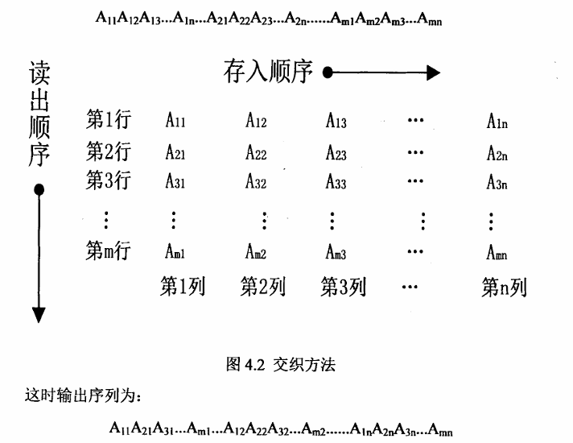
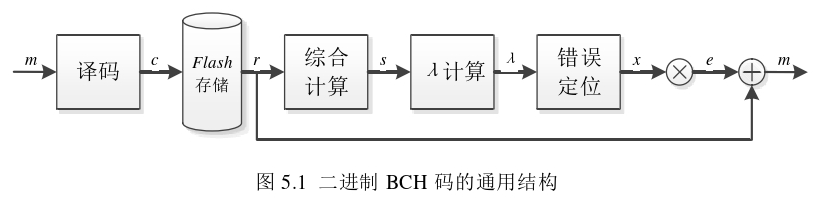
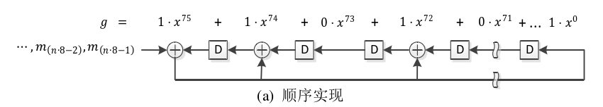
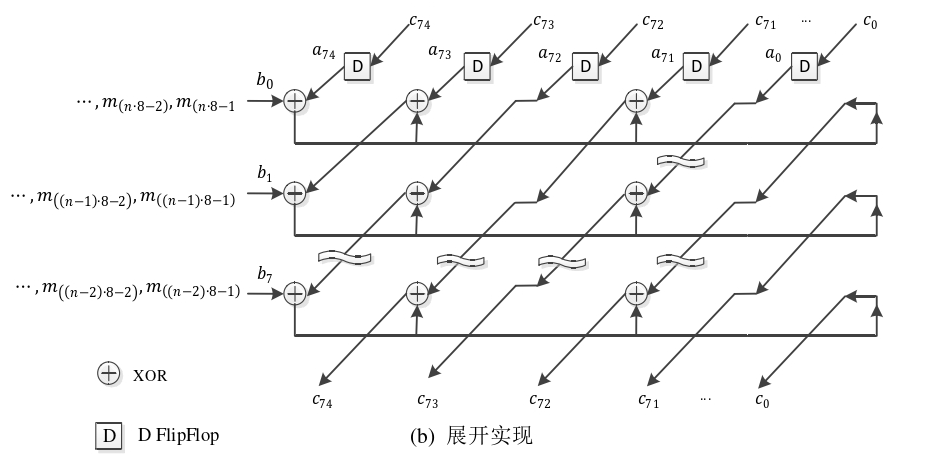
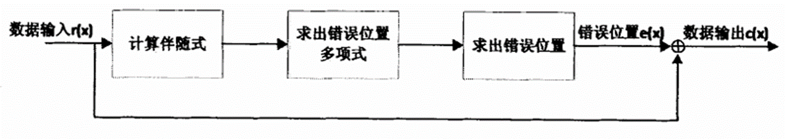
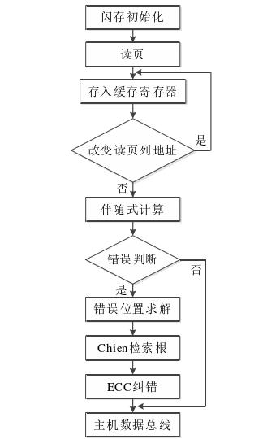
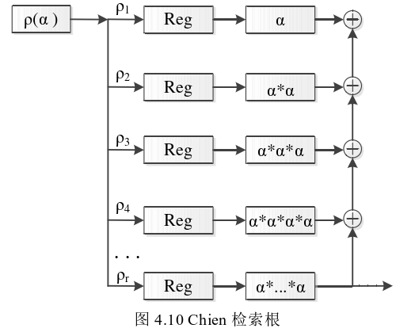

- [ECC机制](#ecc机制)
  - [硬判决和软判决](#硬判决和软判决)
  - [交织](#交织)
- [BCH码](#bch码)
  - [BCH生成多项式](#bch生成多项式)
  - [BCH编码](#bch编码)
  - [BCH译码](#bch译码)
    - [1.伴随式求解](#1伴随式求解)
    - [2.错误位置多项式求解](#2错误位置多项式求解)
    - [3.Chien检索错误位置多项式的根](#3chien检索错误位置多项式的根)
- [LDPC码](#ldpc码)
- [极化码](#极化码)

## ECC机制
**错误方式**：3D NAND闪存每种状态的阈值电压分布发生偏移，由于移动和加宽，不同状态的阈值电压分布开始重叠，读取的参考电压不再能够正确识别重叠区域中某些闪存单元的状态，从而导致读取错误。 

ECC在数据信息里添加了冗余项，于是读取时可以借助进行错误检测并将数据信息恢复成最接近写入时的样子，加入了冗余项的编码数据通常被称为码字。

**分类**：BCH和LDPC

$A$代表码字大小，与其对应的由码率的概念。

原始误码率：
$$
RBER = \frac{\text{Number of bit errors}}{\text{Total number of bits}}
$$
错误率FER(Frame Error Rate)：
$$
FER = 1 - \left[ \left(1 - RBER\right)^{A} + \binom{A}{1} RBER \left(1 - RBER\right)^{A-1} + \ldots + \binom{A}{t} RBER^t \left(1 - RBER\right)^{A-t} \right]
$$

其中$\binom{A}{m} RBER^m(1 - RBER)^{A-m}$表示有m个比特发生错误，而错误数大于t时无法纠正，产生总体的不可修复错误。

不可修复误码率:
$$UBER=\frac{FER}{A}$$

### 硬判决和软判决
**硬判决**：用数字方式处理所有的数据，即“0”或“1"，模拟信息通过使用一个固定的参考电压被转换为数字格式。

**软判决**：使用可靠性来做出决定：例如，一个数据读为“0”有90%的概率，而读为“1”的概率为10%，则判决为“1”。**3D NAND闪存使用的是软判决码。**

BCH码有相对固定的编码和译码算法，主要以硬判决为主，硬件实现起来较简单。LDPC码是前向纠错码，主要以软判决为主，有着接近香农极限的良好性能。

码C是一组码字集合，它通过一种明确的方式将空间A中$k^q$个长度为$k$的信息关联到空间B中$k^q$个长度为$n$的码字。 **若给定两个码字，和仍是一个码字，则该码为线性的，此时该码的编码和解码过程可以用矩阵运算来描述。** 

将编码C的生成矩阵定义为G，所有的码字都可以通过矩阵G的行元素的组合而获得。因此，编码一个数据信息m相当于下式那样，将信息m乘以码生成矩阵G。 
$$c=m\cdot G$$

如果 $G = \left( I_k , P \right)$，这里 $I_k$ 是单位矩阵 $k \times k$，$P$ 是矩阵 $k \times (n-k)$，则 $G$ 被称为标准式或系统形式。如果 $G$ 是标准形式，一个码字的开始 $k$ 个符号被称为信息符号。根据系统形式的矩阵 $G$，可以直接得出校验矩阵 $H = \left(-P^T, I_{n-k} \right)$，其中 $P^T$ 是 $P$ 的转置，它是 $(n-k) \times k$ 的矩阵，$I_{n-k}$ 是 $(n-k) \times (n-k)$ 的单位矩阵。系统码优点在于数据消息可以在码字中清楚地识别出来，因此它可以在解码之前读取。对于非系统码，消息在编码序列中不能被识别，并且需要具有逆编码功能来识别数据序列。

若 $C$ 是具有校验矩阵 $H$ 的线性码，则 $x \cdot H^T$ 称为 $x$ 的校验子。于是所以码字的校验子都等于 $0$。校验子是解码的关键因素，一旦收到消息 $r$ （即从存储器中读取），有必要了解它是否已被破坏，通过下面计算：
$$s = x \cdot H^T$$
若$s=0$，则接受消息r正确，否则包含错误。

错误时，解码过程开始，为了知道可以纠正或检测一个码字有多少错误，编码理论中定义了码的最小距离为度量标准，它对应于两个码字之间不同符号的最小个数。一种码能够识别出最多v个错误的全部信息，则称它具有检测能力V。检测能力与下式描述的最小距离有关。 
$$v=d-1$$
若能够纠正最多 $t$ 个错误的每种组合情况，则该码具有纠错能力 $t$，这个纠错能力由最小距离 $d$ 计算，如下式所示。
$$t=[ \frac{d-1}{2}]$$

其中方括号代表着下取整函数。
### 交织
**目的**：将突发错误转换为随机错误处理。

**方式**：发送前经过交织技术的置换，然后接收端再经过解交织反置换。

**优点**： 

1. 增加纠错码的纠正能力。
2. 降低系统整体误码率。

**缺点**：先存后读，增加了通信延迟。

## BCH码
BCH码属于循环代数码，在构造时就可以确定它的最小距离

**优点**：构造直接方便，编解码硬件实现简单。在码长较短的情况下，性能接近于理论值。

若有限域中的符号数目为 $2^n$，则称此有限域为伽罗华域，记为 $GF({2}^{n})$。例如，若有仅两个符号 “0” 和 “1”，以及它们如下的加法和乘法定义：
$$ 0+0=0,0+1=1,1+0=1,1+1=0 $$
$$ 0·0=0,0·1=0,1·0=0,1·1=1 $$
则称其为 $GF(2)$，又称二元域。

BCH码本身的定义是基于距离的概念和伽罗瓦域。令 $\beta$ 是伽罗瓦域 $GF(q^m)$ 的元素，令 $b$ 为负整数。具有汉明距离 $d$ 的 BCH 码由最小多项式 $g(x)$ 生成，多项式的根为 $d$-1 个连续的 $\beta$ 的幂：$\beta^b$，$\beta^{b+1}$，…，$\beta^{b+d-2}$。令 $\psi_i$ 是 $\beta^{b+i}$ 的最小多项式，$0 \le i < d - 1$，则 $g(x)$ 按照下面计算，而且被保护的数据是 $k=n-deg(g(x))$。其中LCM表示最小公倍式。

$$ g\left(x\right)=LCM\left\{\psi_0\left(x\right),\psi_1\left(x\right),\cdots,\psi_{d-2}\left(x\right)\right\} \tag{5.8} $$

$d$ 至少是 $2t+1$，该码至少可以纠正 $t$ 个错误。假设 $b=1$，并且 $\beta$ 是 $GF(q^m)$ 的本单元，则该码成为狭义的原始 BCH 码，它的长度为 $q^m-1$，且能纠正 $t$ 个错误。BCH 码的通用的结构如下图。

对于任意正整数$m(m>=3)$和$t(t<2^{m-1})$，其一般参数如下： 

码长： $n={2^{m-1}}$

信息位长度： $k$

检验位长度： $n-k\leqslant mt$

汉明最小距离： ${d}_{min}\geqslant 2t+1$

所以对于码长为$2^{m-1}$的BCH码，要想纠正$t$位错误，那么就必须有$mt$位奇偶校验位。如果错误位数超出$t$位，那么BCH码就无法判断错误位置。一般情况下我们将这种类型的BCH码记为$(n,k,t)$码。 

### BCH生成多项式

BCH 码的构造是基于伽罗华二元域 $GF({2}^{m})$ 的，并且其生成多项式 $g(x)$ 由伽罗华二元域 $GF({2}^{m})$ 上的根确定。对于纠正 $t$ 个错误的 BCH 码，它的生成多项式 $g(x)$ 就是 $GF({2}^{m})$ 上以 ($\alpha$,$\alpha^2$,$\alpha^3$,$\alpha^4$,...,$\alpha^{2^t}$) 为根的最低次数多项式，$\alpha$ 是 $GF({2}^{m})$ 的本原元。

为什么生成多项式以 ($\alpha$,$\alpha^2$,$\alpha^3$,$\alpha^4$,...,$\alpha^{2^t}$) 为根？

**接收码字有 t 个错误，那么伴随矩阵会有 2t 个非零项**，类似CRC校验。为了保证纠错能力为t，因此需要以上面的项为根。

我们假设 $\phi_i(x)$ 代表对应每个根 $\alpha^i$ 的最小多项式，则生成多项式 $g(x)$ 可由 $\phi_1(x),\phi_2(x),\phi_3(x),...,\phi_{2t}(x)$ 的最小公倍式来表示，如下所示：
$$ g(x)=LCM\{\phi_1(x),\phi_2(x),\phi_3(x),...,\phi_{2t}(x)\} \tag{4.3} $$

在式（4.3）中，对于 $1≤i≤2t$ 范围内的 $i$，如果 $i$ 是偶数，那么 $i$ 等价于 $2$ 的幂和一个奇数的乘积，即 $i=i'2^l$。又因为 $\alpha^i$ 和 $\alpha^{i'}$ 是共轭元，因此它们有一样的最小多项式，$g(x)$ 进一步写为：
$$ g(x)=LCM\{\phi_1(x),\phi_3(x),\phi_5(x),...,\phi_{2t-1}(x)\} \tag{4.4} $$

生成多项式 $g(x)$ 的推导步骤：

1）确定伽罗华域 $GF({2}^{m})$ 的一个本原元 $a$、码元长度 $N={2}^{m}-1$ 和纠错个数 $t$；

2）确定伽罗华域 $GF({2}^{m})$ 的本原多项式 $p(x)$，令 $p(a)=0$，本原多项式 $p(x)$ 可由查表获得；

3）由本原多项式 $p(x)$ 生成伽罗华域 $GF({2}^{m})$ 上的所有元素；

4）将根 $\left\{1,a^1,a^2,...,a^{2^m-2}\right\}$ 在伽罗华域 $GF({2}^{m})$ 内分成共轭根组；

5）根据所生成的共轭根组来确定最小多项式 $m_i(x)$；

6）$g(x)=LCM(m_1(x),m_3(x),...,m_{2t-1}(x))$；

7）生成多项式。

### BCH编码
假设一个 BCH 码 [n, k] 具有多项式 $g(x)$ 和一个要被编码的消息 $m(x)$，该消息被写为 $k$-1 次的多项式。首先，根据式（5.9）及式（5.10），获得商 $q(x)$ 和余数 $r(x)$。
$$ \frac{m(x)\cdot x^{n-k}}{g(x)} = q(x)+\frac{r(x)}{g(x)} \tag{5.9} $$
$$ m(x)\cdot x^{n-k} + r(x) = q(x)\cdot g(x) \tag{5.10} $$
式中 $m(x)\cdot x^{n-k}$ 的结果产生了 $n$-1 次多项式，其中开头的 $n-k$ 个系数（现在为零）将由奇偶校验位占用。因此编码码字 $c(x)$ 如下计算：
$$ c(x)=m(x)\cdot x^{n-k}+r(x) \tag{5.11} $$

式（5.11）的实际实现方式如下图所示，因为考虑的是二进制 BCH 码，求和实际是一个 XOR，输出结果是一个 AND。

BCH 编码的结构是顺序的，这对于高速实现并不利，因为它慢慢以节、字或双字的方式进行处理。图（b）显示了展开的实现，假设处理为 1 次 1 字节。在图中可以看到每个寄存器的内容不再依赖于单个输入，而是整个字节。

假设BCH码经过编码后得到的目标码字为$c(x)$，校验位的码字为$e(x)$，那么有： 
$$c(x)=x^{n-k}m(x)+e(x)$$
假设信息位的多项式为：
$$ m(x)=m_{i-1}x^{i-1}+m_{i-2}x^{i-2}+m_{i-3}x^{i-3}+...+m_2x^2+m_1x+m_0 $$

生成多项式 $g(x)$ 为：
$$ g(x)=g_{n-j}x^{n-j}+g_{n-j-1}x^{n-j-1}+g_{n-j-3}x^{n-j-3}+...+g_2x^2+g_1x+g_0 $$

那么校验位 $e(x)$ 多项式为：
$$ e(x)=x^{n-k}m(x)mod g(x) $$

所以经过 BCH 编码后得到的码字为：
$$ c(x)=x^{n-k}m(x)+x^{n-k}m(x)mod g(x) $$

综上所述，BCH码的编码主要分为以下过程：首先对信息码$m(x)$左移，将左移后的新码字多项式 $x^{n-k}m(x)$ 对 $g(x)$ 整除，得到商后的余式即为校验多项式 $e(x)$；然后将信息码左移后的 $x^{n-k}m(x)$ 与校验多项式 $e(x)$ 相加，即可得到编码后的码字。
### BCH译码
BCH码的译码操作主要分为以下过程：伴随式求解、错误位置多项式求解和Chien检索 错误位置多项式的根。NAND闪存BCH译码流程如下图所示。 

#### 1.伴随式求解
假设发送码字的多项式为：
$$ c(x)=c_{n-1}x^{n-1}+c_{n-2}x^{n-2}+c_{n-3}x^{n-3}+...+c_1x+c_0 \tag{4.10} $$

接收码字的多项式为：
$$ r(x)=r_{n-1}x^{n-1}+r_{n-2}x^{n-2}+r_{n-3}x^{n-3}+...+r_1x+r_0 \tag{4.11} $$

错误多项式为 $e(x)$，那么有：
$$ r(x)=c(x)+e(x) \tag{4.12} $$

因为 ($\alpha$, $\alpha^2$, $\alpha^3$, $\alpha^4$,...,$\alpha^{2^n}$) 是生成多项式 $g(x)$ 在 $GF(2^m)$ 上有限域的根，所以有：
$$ g(\alpha)=g(\alpha^2)=g(\alpha^3)=...=g(\alpha^{2^n})=0 \tag{4.13} $$
又因为 $r(\alpha^j)=c(\alpha^j)+e(\alpha^j)$，其中 $1≤j≤2t$，所以校验子多项式 $S_j(x)$ 为：
$$ S_j(x)=c(\alpha^j)+e(\alpha^j)=e(\alpha^j)=r(\alpha^j) \tag{4.15} $$

$$ S_j(x)=r_{n-1}α^{jn-1}+r_{n-2}α^{jn-2}+r_{n-3}α^{jn-3}+...+r_1α^j+r_0 \tag{4.16} $$

#### 2.错误位置多项式求解
由上述的校验子求解式（4.15）可知，校验子多项式的求解只与错误多项式 $e(x)$ 有关。假设有 $r$ 个错误位于位置 $y^i,y^{i},y^{i},y^{i},...,y^{i}$，那么有：
$$ e(x)=y^{i}+y^{i}+y^{i}+y^{i}+...+y^{i} \tag{4.17} $$

在上式（4.17）中，将 $\alpha^i$ 带入 $y$，并且 $0≤y^i<y^{i}<y^{i}<...<y^{i}<n$，那么有：
$$ S_1=e(\alpha^2)=\alpha^{i}+\alpha^{2i}+\alpha^{3i}+...\alpha^{ri}  $$
$$ S_2=e(\alpha^3)=(\alpha^{i})^2+(\alpha^{2i})^2+(\alpha^{3i})^2+...+(\alpha^{ri})^2 $$
$$ S_3=e(\alpha^4)=(\alpha^{i})^3+(\alpha^{2i})^3+(\alpha^{3i})^3+...+(\alpha^{ri})^3 \tag{4.18}$$
$$ ... $$
$$ S_{2t}=e(\alpha^{2^t})=(\alpha^{j_1})^{2^t}+(\alpha^{j_2})^{2^t}+(\alpha^{j_3})^{2^t}+...+(\alpha^{j_r})^{2^t} $$

令 $\alpha^{j_i}=\lambda_i$，对上式（4.18）简化，代入可得：
$$ S_1=e(\alpha)=\lambda_1+\lambda_2+\lambda_3+...+\lambda_r $$
$$ S_2=e(\alpha^2)=(\lambda_1)^2+(\lambda_2)^2+(\lambda_3)^2+...+(\lambda_r)^2 $$
$$ S_3=e(\alpha^3)=(\lambda_1)^3+(\lambda_2)^3+(\lambda_3)^3+...+(\lambda_r)^3 \tag{4.19} $$
$$ ... $$
$$ S_{2t}=e(\alpha^{2^t})=(\lambda_1)^{2^t}+(\lambda_2)^{2^t}+(\lambda_3)^{2^t}+...+(\lambda_r)^{2^t} $$

上式（4.19）是非线性的幂和称方程组，求解难度较大。因此引入错误位置多项式：
$$ ρ(x)=(1+\lambda_1x)(1+\lambda_2x)(1+\lambda_3x)...(1+\lambda_rx) \tag{4.20} $$
$$ ρ(x)=ρ_0+ρ_1x+ρ_2x^2+...+ρ_r^{}x^r $$

因此错误位置多项式的系数为：
$$ ρ_0=1 $$
$$ ρ_1=\lambda_1+\lambda_2+\lambda_3+...+\lambda_r $$
$$ ρ_2=\lambda_1λ_2+\lambda_1λ_3+...+\lambda_{r-1}λ_r $$
$$ ρ_3=\lambda_1λ_2λ_3+\lambda_1λ_2λ_4+...+\lambda_{r-2}λ_{r-1}λ_r \tag{4.21} $$
$$ ... $$
$$ ρ_r=\lambda_1λ_2λ_3...λ_r $$

将上式（4.19）和式（4.21）结合，错误位置多项式的系数关系式可得：
$$ ρ_0=1 $$
$$ S_1+\rho_1=0 $$
$$ S_2+S_1\rho_1+2\rho_2=0 $$
$$ S_3+S_1\rho_2+S_2\rho_1+3\rho_3=0 \tag{4.22}$$
$$ ... $$
$$ S_r+S_{r-1}\rho_1+S_{r-2}\rho_2+...+r\rho_r=0  $$

对上式（4.22）求解，即可得到错误多项式的系数。求解错误多项式常见的算法有经典BM算法、ME算法和无求逆BM算法等。无求逆BM算法代替逆元进行运算，大大减少了迭代次数，已成为目前使用最多的主流算法。
#### 3.Chien检索错误位置多项式的根 

Chien 检索错误位置多项式 $\rho(x)$ 的根，其思想是利用穷举法来逐个求解的。由于 $\rho(x)$ 根的倒数即为错误位置，假设 $\alpha^k$ 是错误位置多项式 $\rho(x)$ 的根，那么有：
$$ \rho(\alpha^k)=0=\rho_0+\rho_1\alpha^{k}+\rho_2\alpha^{2k}+...+\rho_r\alpha^{rk} \tag{4.23} $$

Chien 译码器需要对上式（4.23）中的每一项，分别相乘运算再相加求和，根据结果来判断错误位置。如果求和结果为 0，则说明接收码字中第 $(n-k)$ 位发生了错误。以此类推，译码器需要对 ($\alpha^0,\alpha^1,\alpha^2,...,\alpha^{2^m}$) 中的每个元素进行穷举判断，Chien 检索根如下图 4.10 所示。

## LDPC码
LDPC (Low Density Parity Check，低密度奇偶检查码) 码可以被视为一种特定的ECC技术，它通过构建稀疏的检验矩阵实现纠错。

## 极化码