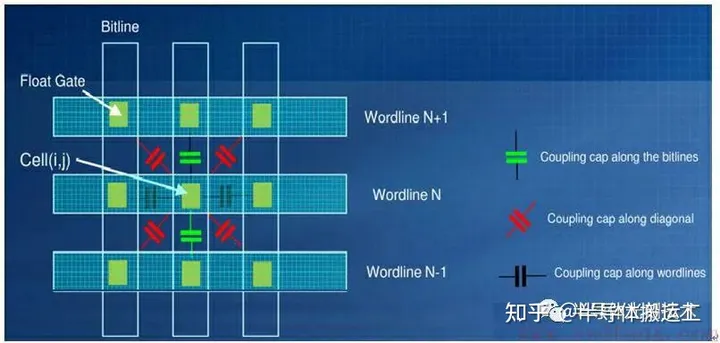

<!-- vscode-markdown-toc -->
* 1. [读/写干扰](#)
* 2. [数据保持性](#-1)
* 3. [坏块管理](#-1)
* 4. [擦写次数限制](#-1)
	* 4.1. [随机电报噪声干扰](#-1)
	* 4.2. [数据保留噪声干扰](#-1)
* 5. [NAND Flash写入干扰](#NANDFlash)
	* 5.1. [VPASS电压过高引起的写入干扰](#VPASS)
	* 5.2. [VPASS电压过低引起的写入干扰](#VPASS-1)
	* 5.3. [过量写入引起的写入干扰](#-1)
	* 5.4. [YUPIN耦合效应引起的写入干扰](#YUPIN)
* 6. [NAND Flash写入干扰改善方法](#NANDFlash-1)

<!-- vscode-markdown-toc-config
	numbering=true
	autoSave=true
	/vscode-markdown-toc-config -->
<!-- /vscode-markdown-toc -->

# NAND Flash常见问题

1. **物理损耗**：
    - 闪存单元在重复擦写次数达到一定的阈值之后会产生磨损，这可能导致一些存储单元不再可用（坏块）。
2. **位翻转（Bit Flip)**：
    - NAND Flash存储器在没有任何外部干预的情况下，也可能出现单个bit从1变成0或者从0变成1的情况，称为位翻转错误。
3. **读/写干扰**：
    - 对NAND Flash的某些操作，如频繁读取，可能会影响到相邻单元的稳定性，导致数据的非预期改变。
4. **损耗机制**：
    - NAND Flash的损耗模式可能表现为均匀损耗或者局部损耗，这取决于块的使用频率等因素。
5. **数据保持性**：
    - 存储的数据在没有读写操作的情况下可能会随着时间而退化，导致数据丢失。

##  1. 读/写干扰

NAND读取操作：以页尾单位，一次读取整页，先选择块，再选择位线，读取电压5V打开所有未选择的存储单元，如果存储单元是1，则VT<0，通道没有电流，如 果存储单元是0，则VT>0，通道有电流通过。

写入过程：一次同时写一个页， 先选择块，再选择位线，被选择的位线加电压20V，未选择的位线加电压10V，被编程的字符串接地;其他字符串加10V，相邻的字线被加压10V。

**读取某个页时，邻近的bit位会受到升高电压的干扰，造成位出错，导致写入干扰现象的读取次数门槛介于区块被抹除间**。

假如连续从一个记忆单元读取，此记忆单元将不会受损，而受损却是接下来被读取的周围记忆单元，相邻的存储单元之间由于重叠区域而对彼此产生损害。这些损害会影响阈值电压的探测精度，使得探测到的感知电压发生偏移，在闪存的几种干扰中，它拥有最大的危害。

从图中可以看出，在闪存中，字线 n 和位线 m 相关联的位置位于(n,m)，因此由单元间干扰引起的受害单元的 MLC 闪存阈值电压变化 F 可以估算为：
$$
F_{CCI}=\sum_{k\in(m-1,m+1)}(\Delta V_{(n+1,k)}\cdot\gamma_k)
=\gamma_{xy}\cdot\Delta V_{(n+1,m-1)}+\gamma_y\cdot\Delta V_{(n+1,m)}+\gamma_{xy}\cdot\Delta V_{n+1,m+1}
$$

其中，$\Delta V_{(n+1,k)}$是在编程操作期间第n个干扰单元的阈值电压偏移，受干扰单元与干扰单元之间的耦合比等于$\gamma_k$。$\gamma_{xy}$和$\gamma_y$表示耦合系数，分别是斜对角和$90^。$方向。

MLC NAND闪存由于阈值电压相比SLC NAND闪存更接近，在读/写中很容易对邻近的单元造成干扰。

**解决**：NAND闪存控制器通常会计算从上次抹除动作后的区块读取动作总次数。当计数值超过所设置的目标值门槛时，受影响的区块会被复制到一个新的区块，然后将原区块抹除后释放到区块回收区中。原区块在抹除动作后就会像新的一样。

##  2. 数据保持性

数据保存期限指的是当NAND闪存完全断电后，数据能在NAND闪存里保存多久。NAND存储单元必须保证一个稳定的电压水平，来保证数据无误。典型的SLC NAND闪存一般数据保存期限为10年。

电荷从悬浮门里漏出，存储单元的电压值慢慢地变化，变的和原始值不一样了，我们叫做**电子漂移**，当随着时间的流逝，电荷泄漏到一定程度，改变了NAND存储单元里悬浮门的电压对应的逻辑值，造成位出错。

数据保存期限会随着擦写次数的增加而明显降低，而且从上面的原理中可以看出，MLC NAND闪存的数据保存期限明显会比SLC NAND闪存少。（更容易被干扰） 

##  3. 坏块管理

NAND中有两种坏块类型：

    - 出厂坏块：出厂时NAND就有的坏块。
    - 积累坏块：在多次的写入/擦除循环中，某些NAND存储单元的电荷电压被永久性的改变了，包含这个的NAND单元就不可用了。 

所以固态硬盘需要有坏块管理才能使用，主控制器用坏块表来映射出厂坏块和积累坏块到坏块区内，出厂时，颗粒的第一个块Block0厂商会保证可用（至少ECC后可用）。 

##  4. 擦写次数限制

造成NAND擦写（Program/Erase，PE）次数限制的因素：

    - 1，电荷被困在氧化层，不能进入悬浮门。 
    - 2，氧化层结构被破坏。

<figure class="half">
    
    
</figure>

当氧化层损坏到达一定程度时，电荷越来越难在P-substrate和悬浮门之间流动。电荷被困在氧化层造成悬浮门中的电压到不了阈值电压，所以说这个 NAND单元就要被放入坏块区了。 
###  4.1. 随机电报噪声干扰
由于在 P/E 循环过程中，在靠近界面的电荷陷阱位置发生的电子捕获和发射事件，会导致阈值电压转移和波动。在达到一定数量的编程周期后，闪存单元的氧化层也将受到损伤，使得闪存的持久性下降。RTN 的概率密度函数$p_{RTN}(x)$可以建模为参数$\lambda_r$的对称指数函数:
$$p_{RTN}(x)=\frac{1}{2\lambda_r}e^{-\frac{|x|}{\lambda_r}},\lambda_r=K_r\times N^{0.5}$$

其中变量$x$代表阈值电压，$\lambda_r$表示循环次数，且非递减，N表示 P/E 循环次数，$K_r$是一个常量。
###  4.2. 数据保留噪声干扰
在经过较长时间的存储和多次 P/E 循环后，电荷发生泄露，减弱了数据保留的能力，即闪存保持电荷的能力降低或受到限制。由于界面陷阱恢复和电子去陷阱而导致的阈值电压降低，DRN的概率密度函数$p_{DRN}(x)$可以近似建模为高斯分布$N(\lambda_d,\sigma_d^2)$，计算公式如下：
$$
\begin{cases}
 \mu_d=K_s(x-x_0)K_dN^{0.5}\ln(1+t/t_0)\\
 \sigma_d^2=K_s(x-x_0)K_mN^{0.5}\ln(1+t/t_0)\\
 \end{cases}
 $$
其中，$\mu_d$代表均值，$\sigma_d$代表标准差。$K_s、K_d、K_m$是常量，$x_0$表示MLC单元处于擦除状态时的阈值电压初值。$t$表示的是记忆持续的时间，$t_0$是初始时间。

NAND Flash存储体（电子俘获技术）通过基于浮栅的MOS管，即胞元来存储信息，根据胞元阈值电压的不同表征存储信息的不同。胞元浮栅极上下被绝缘层包围，当电荷通过编程注入浮栅后，就算隧穿层有缺陷，跑掉的也只是这个缺陷周边的电子，电荷也不会泄漏，存储的信息也不会丢失。

##  5. NAND Flash写入干扰

###  5.1. VPASS电压过高引起的写入干扰 

会发生在所选位线上的相邻单元，如果所选位线上的相邻单元数据为1，且VPASS电压过高时，它的存储信息就会发生改变（从1变成0），造成数据出错。

###  5.2. VPASS电压过低引起的写入干扰 

发生在所选字线的相邻单元，如果所选字线的相邻单元信息为1，当VPASS电压过低时，P-substrate增压不够，控制栅极电压大于VPASS，它的存储信息就会发生改变（从1变成0），造成数据错误。

浮栅Flash和电子俘获Flash相比，后者抗干扰能力差，高温下数据保持能力弱，在读数据时受Vpass电压影响更容易造成Vt上升，导致存储的信息由0变为1。

###  5.3. 过量写入引起的写入干扰 

由于一小部分电子会比预期的跑的更快，这些位的电压会比预期的更高，导致阈值电压过高，且大于Vread电压，这种情况下，这些位读出来的信息就都为0，导致数据出错。

###  5.4. YUPIN耦合效应引起的写入干扰 

**YUPIN效应**：相邻浮栅之间耦合的电荷的影响。

**解释**：FG flash（Floating Gate）的浮栅极材料是导体。任何两个彼此绝缘且相隔很近的导体间都构成一个电容器。因此，任何两个存储单元的浮栅极就构成一个电容器，一个浮栅极里面电荷的变化，都会引起别的存储单元浮栅极电荷的变化。 一个浮栅极与其附近的浮栅极之间，都存在耦合电容，这个电容大小与彼此之间距离成反比：距离越短，电容越大，彼此影响越大（平板电容器电容公式C=εS/4πkd，其中d就是平板之间距离）。因此，随着闪存制程减小，存储单元之间影响越来越大。因此，Cell-to-Cell interface也是影响制程继续往前的一个因素。

YUPIN效应会引起相邻浮栅的阈值电压过高，导致写入数据出错，下图显示的是字线与字线，位线与位线浮栅耦合效应示意图。 

Floating Gate Flash对浮栅极下面的绝缘层（Tunnel氧化物）很敏感，该氧化物厚度变薄（制成减小导致的）或者老化（degradation, 擦写次数多了），浮栅极里面的电子就容易跑出来。浮栅极里面的电子可以自由移动，是从不良绝缘层跑出来的关键。

因为电容与导体之间的距离成反比，所以**闪存的工艺越先进，浮栅的电容耦合问题就越突出**。当不得不为了解决这个问题而让两个浮栅(也就是两个存储单元)保持相当间距的时候，它与电荷俘获技术的成本差异就开始显现了。相比2D NAND，在3D NAND中，上下两层的Floating Gate之间如果需要保持比Trapping Layer之间更大的间距，还会造成更多问题，比如更大的刻蚀深度、更长的刻蚀时间、要求更先进的刻蚀设备等等。这也是为什么2D NAND时代以及低层数的3D NAND时代，大家对Floating Gate的耦合问题还能忍一忍，到了高层数3D NAND时代，Z方向的刻蚀主导了成本，最终大家都无法忍受。

##  6. NAND Flash写入干扰改善方法

1. **确定VPASS电压值范围改善写入干扰**：
    - 计算被写入块区域的每个页的错误位，通过曲线图来找合理的VPASS电压范围值。 
2. **改善位线与位线之间YUPIN效应引起的写入干扰**：
    - 对奇偶单元同时编程能有效减少位线与位线之间YUPIN效应引起的写入干扰。 
3. **改善字线与字线之间YUPIN效应引起的写入干扰**：
    - 改变字线写入的方法，按字线顺序从第0页到第255页逐一写入，能有效减少YUPIN效应。

